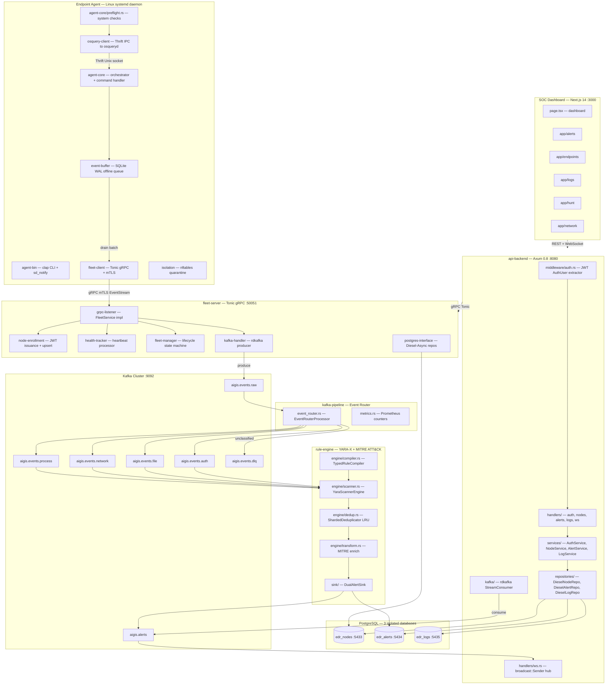
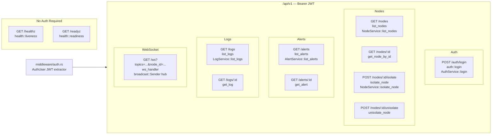
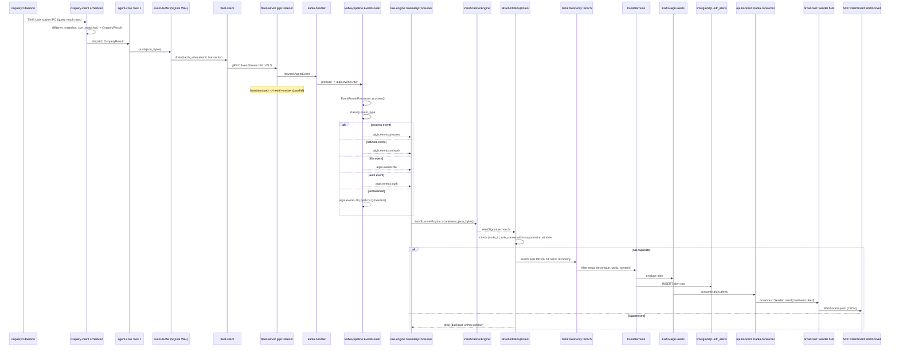
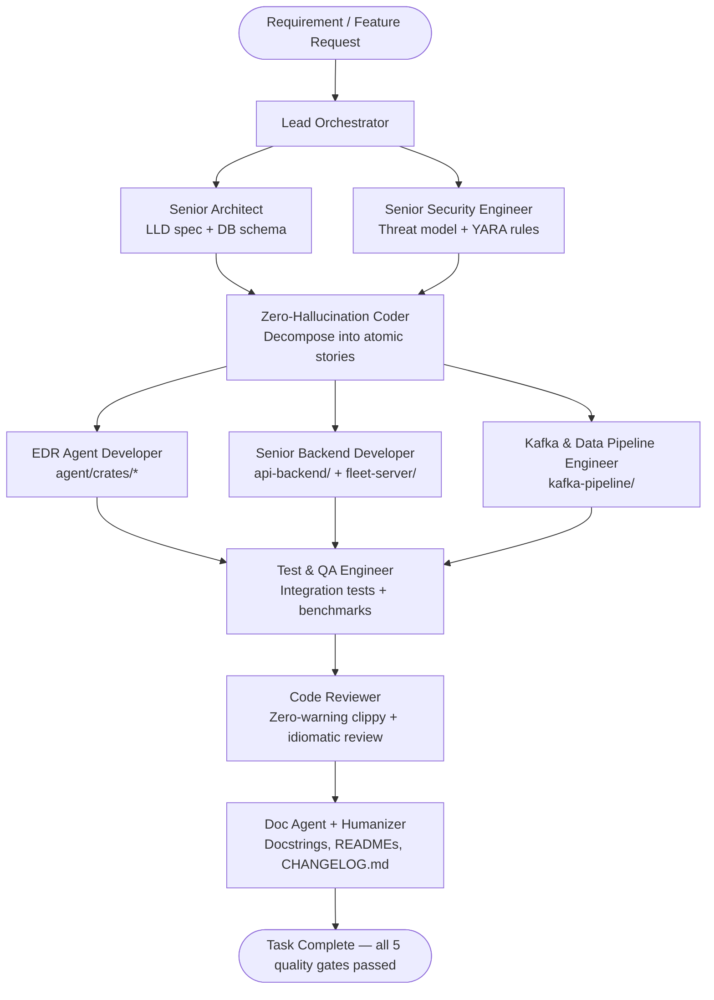

# AGENTS.md — Aigis-Zero EDR: Agent & Developer Operating Manual

> **Read this file first.** Every AI agent and human engineer working in this repository must read this document before writing a single line of code.
> Inspired by the contributor guides of [tokio](https://github.com/tokio-rs/tokio/blob/master/CONTRIBUTING.md), [axum](https://github.com/tokio-rs/axum/blob/main/CONTRIBUTING.md), [rust-analyzer](https://github.com/rust-lang/rust-analyzer/blob/master/docs/dev/guide.md), and [VSCode](https://github.com/microsoft/vscode/wiki/How-to-Contribute).

---

## Table of Contents

1. [Mandatory Quality Gates](#1-mandatory-quality-gates)
2. [Scripts Reference](#2-scripts-directory-reference)
3. [Codebase Architecture & Feature Map](#3-codebase-architecture--feature-map)
4. [Where Is Feature X?](#4-where-is-feature-x-quick-lookup-table)
5. [Data Flow: End-to-End Event Lifecycle](#5-data-flow-end-to-end-event-lifecycle)
6. [Database Schema Reference](#6-database-schema-reference)
7. [Kafka Topic Topology](#7-kafka-topic-topology)
8. [gRPC Protocol Reference](#8-grpc-protocol-reference)
9. [REST API Contract](#9-rest-api-contract)
10. [Env Config Reference](#10-env-config-reference)
11. [Idiomatic Rust Standards](#11-idiomatic-rust-standards)
12. [Changelog Maintenance](#12-changelog-maintenance)
13. [Virtual Engineering Team & Orchestration](#13-virtual-engineering-team--orchestration)

---

## 1. Mandatory Quality Gates

**Every task, PR, and commit must pass all five gates before it is considered done.** No exceptions.

| # | Gate | Command | Failure Action |
|---|------|---------|----------------|
| 1 | Zero clippy warnings | `cargo clippy --workspace --all-targets --all-features -- -D warnings` | Fix all warnings before proceeding |
| 2 | Nightly formatting | `cargo +nightly fmt --all` | Run with `--check` in CI; auto-fix locally |
| 3 | All tests pass | `cargo test --workspace --all-features` | Fix failing tests; never `#[ignore]` without a tracking issue |
| 4 | Zero typos | `./scripts/check.sh` | Fix typos in code and docs |
| 5 | Changelog updated | Edit `CHANGELOG.md` under `[Unreleased]` | Add entry per Section 12 format |

**The fastest local gate loop:**
```bash
./scripts/check.sh --fix   # formats, auto-fixes clippy, runs typos
cargo test --workspace     # must show 0 failures
```

---

## 2. Scripts Directory Reference

**Rule:** Always invoke scripts from the repository root. Never run ad-hoc `cargo` commands in CI or as a pre-commit substitute.

### `./scripts/check.sh` — Daily driver

```
./scripts/check.sh [all|frontend|backend|<service>] [--fix]
```

| Target | What it checks |
|--------|---------------|
| `all` (default) | Entire workspace: Rust + frontend |
| `backend` | All Rust crates via clippy + nightly fmt |
| `frontend` | Next.js ESLint + TypeScript tsc |
| `api-backend` | Only the `api-backend` crate |
| `fleet-server` | Only `fleet-server/crates/*` |
| `agent` | Only `agent/crates/*` |
| `kafka-pipeline` | Only the `kafka-pipeline` crate |
| `rule-engine` | Only the `rule-engine` crate |
| `sdk` | Only the `sdk` crate |

`--fix` auto-applies `rustfmt`, `cargo clippy --fix`, and `eslint --fix`.

### `./scripts/ci.sh` — Pre-push mirror of GitHub Actions

Runs: fmt-check, clippy, typos, full build, test suite, `cargo doc`, `cargo audit`. **Must pass before every push.**

### `./scripts/infra.sh` — One-command local stack

```bash
./scripts/infra.sh up      # Start PostgreSQL x3, Kafka, Zookeeper, Kafka UI
./scripts/infra.sh down    # Stop all containers
./scripts/infra.sh reset   # Tear down + full reseed
./scripts/infra.sh seed    # Apply migrations + seed.sql without restart
./scripts/infra.sh status  # Health check all containers
```

### `./scripts/seed.sh` — Database fixtures

```bash
./scripts/seed.sh           # Apply fleet-server/migrations/seed.sql to live DBs
./scripts/seed.sh --reset   # DROP + CREATE + migrate + seed
```

### `./scripts/setup.sh` — Onboarding / toolchain install

Installs: `libpq`, `openssl`, `pkg-config`, `protobuf`, `cmake`, Rust nightly, `typos-cli`, `cargo-audit`, `cargo-cache`, `sqlx-cli`. Marks all scripts executable.

### `./scripts/fetch-rules.sh` — Sync YARA rules

Downloads the latest MITRE ATT&CK Linux enterprise JSON taxonomy and bundles it into `rule-engine/rules/mitre/`.

### `./infra/scripts/create-topics.sh` — Kafka topic provisioning

Creates all Kafka topics with correct partition counts and retention inside the running Docker container.

---

## 3. Codebase Architecture & Feature Map

### System Overview



---

### 3A. `sdk/` — Shared Wire Contracts

The SDK is the **single source of truth** for all cross-crate domain types and Protobuf schemas. It has zero business logic.

| File | Purpose |
|------|---------|
| [`sdk/proto/fleet.proto`](file:///home/eleven/c/r/oss/aigis-zero/sdk/proto/fleet.proto) | `FleetService` gRPC: `RegisterAgent`, `EventStream` (bidi), `Heartbeat`. Defines all message types. |
| [`sdk/proto/agent.proto`](file:///home/eleven/c/r/oss/aigis-zero/sdk/proto/agent.proto) | `AgentConfig`, `ScheduledQueryProto` |
| [`sdk/proto/events.proto`](file:///home/eleven/c/r/oss/aigis-zero/sdk/proto/events.proto) | `NormalizedEvent`, `Alert`, `Severity`, `MitreAttack` envelopes |
| [`sdk/build.rs`](file:///home/eleven/c/r/oss/aigis-zero/sdk/build.rs) | Compile-time protobuf codegen via `tonic_prost_build` |
| [`sdk/src/models/enrollment.rs`](file:///home/eleven/c/r/oss/aigis-zero/sdk/src/models/enrollment.rs) | `Claims`, `EnrollmentRequest/Response` |
| [`sdk/src/models/event.rs`](file:///home/eleven/c/r/oss/aigis-zero/sdk/src/models/event.rs) | `EventBatch`, `ProcessEvent`, `FileEvent`, `NetworkEvent` |
| [`sdk/src/models/envelope.rs`](file:///home/eleven/c/r/oss/aigis-zero/sdk/src/models/envelope.rs) | Telemetry envelope with node identity + typed payload |
| [`sdk/src/models/heartbeat.rs`](file:///home/eleven/c/r/oss/aigis-zero/sdk/src/models/heartbeat.rs) | `HeartbeatRequest/Response` |
| [`sdk/src/codec.rs`](file:///home/eleven/c/r/oss/aigis-zero/sdk/src/codec.rs) | Framed byte codecs for streaming events |

**Rule:** Never add business logic to `sdk/`. It exports types only.

---

### 3B. `agent/crates/` — Endpoint Agent (7 crates)

The agent runs as a root systemd daemon on Linux endpoints. Each sub-crate has a single responsibility.

#### `agent-bin` — Binary entrypoint
| File | Purpose |
|------|---------|
| [`agent/crates/agent-bin/src/main.rs`](file:///home/eleven/c/r/oss/aigis-zero/agent/crates/agent-bin/src/main.rs) | CLI (clap): validates root UID, loads config, runs preflight, enrolls, starts core + heartbeat + event drain loops, `sd_notify` |

#### `agent-core` — Orchestration engine
| File | Purpose |
|------|---------|
| [`agent/crates/agent-core/src/lib.rs`](file:///home/eleven/c/r/oss/aigis-zero/agent/crates/agent-core/src/lib.rs) | `AgentCore` struct: supervises Task 1 (osquery polling) and Task 2 (gRPC bidi command listener with exponential backoff) |
| [`agent/crates/agent-core/src/orchestrator.rs`](file:///home/eleven/c/r/oss/aigis-zero/agent/crates/agent-core/src/orchestrator.rs) | Standalone runner: host metadata (`get_os_version`, `read_machine_id`, `hostname_or_default`), TOML hot-reload watcher |
| [`agent/crates/agent-core/src/command_handler.rs`](file:///home/eleven/c/r/oss/aigis-zero/agent/crates/agent-core/src/command_handler.rs) | Dispatches `ServerCommand` variants: `Ack`, `Isolate`, `DeIsolate`, `ConfigUpdate` |
| [`agent/crates/agent-core/src/config.rs`](file:///home/eleven/c/r/oss/aigis-zero/agent/crates/agent-core/src/config.rs) | `AgentConfig`, `OsqueryConfig`, `FleetConfig`, `IsolationConfig` from `agent.toml` |
| [`agent/crates/agent-core/src/preflight.rs`](file:///home/eleven/c/r/oss/aigis-zero/agent/crates/agent-core/src/preflight.rs) | Preflight checks: root UID, kernel >= 4.18, `CONFIG_BPF_SYSCALL`, `/proc`, osquery socket, inotify limits |

#### `event-buffer` — SQLite WAL offline queue
| File | Purpose |
|------|---------|
| [`agent/crates/event-buffer/src/lib.rs`](file:///home/eleven/c/r/oss/aigis-zero/agent/crates/event-buffer/src/lib.rs) | `EventBuffer`: `push` (oldest-first eviction at capacity), `drain(batch_size)` in atomic transaction, `len()`. All ops via `spawn_blocking`. |

#### `fleet-client` — gRPC client to fleet-server
| File | Purpose |
|------|---------|
| [`agent/crates/fleet-client/src/lib.rs`](file:///home/eleven/c/r/oss/aigis-zero/agent/crates/fleet-client/src/lib.rs) | `FleetClient`: `enroll`, `event_stream`, `send_events`, `heartbeat`, `try_receive` |
| `src/connection.rs` | Tonic channel builder, retry loop, TLS/mTLS scaffolding |
| `src/stream.rs` | Bidi streaming channel (mpsc to/from tonic) |
| `src/types.rs` | `AgentEvent`, `EventType` enum |

#### `isolation` — nftables network quarantine
| File | Purpose |
|------|---------|
| [`agent/crates/isolation/src/lib.rs`](file:///home/eleven/c/r/oss/aigis-zero/agent/crates/isolation/src/lib.rs) | `IsolationManager`: `isolate()` / `de_isolate()` / `is_isolated()` via `nft table inet aigis_isolation`. Exempts loopback, established TCP, fleet server IP:port. |

#### `osquery-client` — Thrift IPC to osqueryd
| File | Purpose |
|------|---------|
| [`agent/crates/osquery-client/src/lib.rs`](file:///home/eleven/c/r/oss/aigis-zero/agent/crates/osquery-client/src/lib.rs) | `OsqueryCollector`: spawns scheduler, `live_query`, `update_schedule` |
| `src/client.rs` | Unix domain socket Thrift client to `osqueryd` extension manager |
| `src/scheduler.rs` | `QueryScheduler`: periodic execution, diff calculation, event dispatch |
| `src/diff.rs` | Row diff: `ADDED` / `REMOVED` / `Snapshot` between iterations |
| `src/types.rs` | `OsqueryResult`, `ResultAction`, `ScheduledQuery` |

#### `agent-tracing` — Structured logging init
| File | Purpose |
|------|---------|
| [`agent/crates/agent-tracing/src/lib.rs`](file:///home/eleven/c/r/oss/aigis-zero/agent/crates/agent-tracing/src/lib.rs) | `init(level, LogFormat::Json|Human)` using `tracing-subscriber` with env-filter |

**Agent config file:** [`agent/agent.toml`](file:///home/eleven/c/r/oss/aigis-zero/agent/agent.toml) — log level, DB paths, buffer caps, fleet endpoints, heartbeat intervals.

---

### 3C. `fleet-server/crates/` — gRPC Fleet Controller (8 crates)

Accepts agent gRPC connections, handles enrollment and telemetry forwarding to Kafka.

| Crate | Binary | Purpose |
|-------|--------|---------|
| `fleet-server-bin` | `aigis-fleet` | Entry point: wires all sub-crates, starts Tonic server |
| `grpc-listener` | — | Tonic service implementations for `FleetService` |
| `fleet-manager` | — | Business logic: agent lifecycle state machine |
| `node-enrollment` | — | Enrollment validation, JWT issuance, upsert to PostgreSQL |
| `health-tracker` | — | Heartbeat processing, `agent_status` / `operator_status` updates |
| `kafka-handler` | — | Wraps rdkafka producer; forwards `AgentEvent` to `aigis.events.raw` |
| `postgres-interface` | — | Diesel-async schema, models, and repository implementations |
| `fleet-tracing` | — | Structured logging init for fleet-server binary |

**Fleet-server migrations** (in `fleet-server/migrations/`):

| Migration | Creates |
|-----------|---------|
| `20260601000001_create_nodes.sql` | `nodes` table: `node_id`, `machine_id`, `hostname`, `os_version`, `agent_version`, `agent_status`, `operator_status` |
| `20260601000002_create_enrollment_events.sql` | `enrollment_events` audit log |
| `20260601000003_create_node_health.sql` | `node_health` time-series heartbeat records |

---

### 3D. `api-backend/` — Axum 0.8 Operator Gateway

**Entry:** [`api-backend/src/main.rs`](file:///home/eleven/c/r/oss/aigis-zero/api-backend/src/main.rs) — loads config, builds `AppState`, mounts router, starts Kafka consumer task.

**Route tree** (from [`src/routes/mod.rs`](file:///home/eleven/c/r/oss/aigis-zero/api-backend/src/routes/mod.rs)):



**Layered internals:**

| Layer | Files | Rule |
|-------|-------|------|
| Handlers | `src/handlers/{auth,nodes,alerts,logs,ws}.rs` | Parse HTTP params, call service, return JSON. No DB queries. |
| Services | `src/services/{auth_service,node_service,alert_service,log_service}.rs` | Business rules, coordinate repos + fleet client. |
| Repositories | `src/repositories/{node_repo,alert_repo,log_repo}.rs` | Diesel-async queries only. |
| Middleware | `src/middleware/auth.rs` | `AuthUser` extractor: validates `Bearer` JWT from `Authorization` header. |
| State | [`src/state.rs`](file:///home/eleven/c/r/oss/aigis-zero/api-backend/src/state.rs) | `AppState` wraps `Arc<AppStateInner>`: 3 DB pools, services, `broadcast::Sender<LiveEvent>`. |
| Error | [`src/error.rs`](file:///home/eleven/c/r/oss/aigis-zero/api-backend/src/error.rs) | `AppError` enum: `Unauthorized`, `Forbidden`, `NotFound`, `ValidationError`, `Conflict`, `DatabaseError`, `KafkaError`, `InternalServerError`. Implements `IntoResponse`. |

**WebSocket** (`src/handlers/ws.rs`):
- Subscribe via `GET /api/v1/ws?topics=logs,alerts&node_id=<uuid>`
- Client messages: `{"type":"Subscribe","topics":[...],"node_id":"..."}`, `{"type":"Ping"}`
- Server broadcasts: `LiveEvent::Log`, `LiveEvent::Alert`, `LiveEvent::Heartbeat`
- 30-second server-side ping keepalive

**Kafka consumer** (`src/kafka/`): Consumes `aigis.events.raw`, deserialized into `LiveEvent`, pushed into `broadcast::Sender` (capacity 5000).

---

### 3E. `kafka-pipeline/` — Event Router & Normalizer

**Entry:** [`kafka-pipeline/src/main.rs`](file:///home/eleven/c/r/oss/aigis-zero/kafka-pipeline/src/main.rs)

| File | Purpose |
|------|---------|
| [`src/consumer.rs`](file:///home/eleven/c/r/oss/aigis-zero/kafka-pipeline/src/consumer.rs) | `MessageProcessor` trait + rdkafka consumer loop with at-least-once delivery |
| [`src/event_router.rs`](file:///home/eleven/c/r/oss/aigis-zero/kafka-pipeline/src/event_router.rs) | `EventRouterProcessor`: reads `aigis.events.raw`, classifies `event_type`, normalizes, forwards to typed topic or DLQ |
| [`src/metrics.rs`](file:///home/eleven/c/r/oss/aigis-zero/kafka-pipeline/src/metrics.rs) | Prometheus counters: `consumed`, `routed`, `errors` per topic |
| [`src/health.rs`](file:///home/eleven/c/r/oss/aigis-zero/kafka-pipeline/src/health.rs) | Health endpoint for readiness probes |

**Routing table** (in `event_router.rs::route_topic`):

| Input `event_type` values | Output topic |
|--------------------------|--------------|
| `process_start`, `process_end`, `osquery_result`, `running_processes`, etc. | `aigis.events.process` |
| `network_connect`, `network_listen`, `socket_events`, `listening_ports`, etc. | `aigis.events.network` |
| `file_create`, `file_modify`, `file_delete`, `file_events` | `aigis.events.file` |
| `user_login`, `user_logout`, `logged_in_users`, `auth`, `users` | `aigis.events.auth` |
| Any unclassified | `aigis.events.dlq` |

DLQ messages carry Kafka headers: `x-source-topic`, `x-original-partition`, `x-original-offset`, `x-error-reason`.

---

### 3F. `rule-engine/` — YARA-X Detection & MITRE ATT&CK Alerting

**Entry:** [`rule-engine/src/main.rs`](file:///home/eleven/c/r/oss/aigis-zero/rule-engine/src/main.rs)

Startup sequence:
1. Load MITRE ATT&CK taxonomy from `MITRE_TAXONOMY_PATH`
2. Compile all YARA rules via `TypedRuleCompiler::compile_all(rules_dir)`
3. Build `EngineRegistry` + `RegistryHolder` (hot-swappable via `arc-swap`)
4. Init `ShardedDeduplicator` (LRU + suppression window)
5. Connect PostgreSQL pool + `DualAlertSink` (Kafka + DB)
6. Start `TelemetryConsumer` workers per typed topic
7. CancellationToken-based graceful shutdown

| File/Dir | Purpose |
|----------|---------|
| [`src/engine/scanner.rs`](file:///home/eleven/c/r/oss/aigis-zero/rule-engine/src/engine/scanner.rs) | `YaraScannerEngine`: scans event JSON bytes against compiled YARA rules, extracts `AlertSignature` matches |
| [`src/engine/compiler.rs`](file:///home/eleven/c/r/oss/aigis-zero/rule-engine/src/engine/compiler.rs) | `TypedRuleCompiler`: compiles per-category rule sets from `rules/{process,network,file,auth,custom}/` |
| [`src/engine/dedup.rs`](file:///home/eleven/c/r/oss/aigis-zero/rule-engine/src/engine/dedup.rs) | `ShardedDeduplicator`: LRU-based alert dedup by `(node_id, rule_name)` within suppression window |
| [`src/engine/registry.rs`](file:///home/eleven/c/r/oss/aigis-zero/rule-engine/src/engine/registry.rs) | `EngineRegistry` + `RegistryHolder` (arc-swap hot reload) |
| [`src/engine/transform.rs`](file:///home/eleven/c/r/oss/aigis-zero/rule-engine/src/engine/transform.rs) | Enriches matches with MITRE taxonomy data |
| [`src/mitre/`](file:///home/eleven/c/r/oss/aigis-zero/rule-engine/src/mitre) | `MitreTaxonomy`: loads enterprise-attack-linux.json, maps technique IDs to names/tactics |
| [`src/sink/`](file:///home/eleven/c/r/oss/aigis-zero/rule-engine/src/sink) | `DualAlertSink`: writes alerts to both Kafka (`aigis.alerts`) and PostgreSQL |
| [`src/kafka/`](file:///home/eleven/c/r/oss/aigis-zero/rule-engine/src/kafka) | `TelemetryConsumer`, `AlertKafkaProducer`, `DlqProducer` |
| `rules/process/` | YARA rules for process events |
| `rules/network/` | YARA rules for network events |
| `rules/file/` | YARA rules for file events |
| `rules/auth/` | YARA rules for auth events |
| `rules/custom/` | Custom user-defined rules |
| `rules/mitre/` | MITRE ATT&CK enterprise-attack-linux.json taxonomy |

---

### 3G. `frontend/` — Next.js 14 SOC Dashboard

**Stack:** Next.js 14 (App Router) + TypeScript + Tailwind CSS + Vitest

**Page routes** (all in `frontend/app/`):

| Route | File | Feature |
|-------|------|---------|
| `/` | `app/page.tsx` | Main dashboard: live metrics, node status grid |
| `/login` | `app/login/` | Auth form |
| `/endpoints` | `app/endpoints/` | Node fleet table + isolation controls |
| `/alerts` | `app/alerts/` | Alert feed from rule engine |
| `/logs` | `app/logs/` | Raw telemetry log viewer |
| `/hunt` | `app/hunt/` | Threat hunting query interface |
| `/network` | `app/network/` | Network event visualization |
| `/settings` | `app/settings/` | System configuration |

**Shared components** (`frontend/components/`):

| Component | Purpose |
|-----------|---------|
| `AppShell.tsx` | Root layout shell (sidebar + topbar) |
| `Sidebar.tsx` / `SidebarContext.tsx` | Collapsible navigation sidebar |
| `TopBar.tsx` | Header with search, user menu, alerts badge |
| `CommandPalette.tsx` | `Ctrl+K` global command palette |
| `LogTable.tsx` | Virtualized log/event table |
| `MetricCard.tsx` | Summary metric display card |
| `StatusBadge.tsx` | Node/alert status color indicator |
| `AsciiBackground.tsx` | Animated ASCII art background effect |
| `Can.tsx` | Permission-gated rendering wrapper |
| `ui/` | Primitive UI components (buttons, modals, etc.) |

**Key files:**

| File | Purpose |
|------|---------|
| `frontend/middleware.ts` | Next.js auth guard redirecting unauthenticated users to `/login` |
| `frontend/hooks/` | Custom React hooks (websocket, data fetching) |
| `frontend/lib/` | API client utilities, type helpers |
| `frontend/types/` | Shared TypeScript domain types |
| `frontend/app/api/` | Next.js API route proxies |

---

## 4. Where Is Feature X? — Quick Lookup Table

| "I need to change..." | Look in... |
|-----------------------|-----------|
| The gRPC service contract | [`sdk/proto/fleet.proto`](file:///home/eleven/c/r/oss/aigis-zero/sdk/proto/fleet.proto) |
| Agent enrollment flow | `fleet-server/crates/node-enrollment/` + `agent/crates/fleet-client/src/enrollment.rs` |
| Agent → fleet gRPC stream | `agent/crates/fleet-client/src/stream.rs` |
| Osquery queries / schedule | [`agent/agent.toml`](file:///home/eleven/c/r/oss/aigis-zero/agent/agent.toml) + `osquery-client/src/scheduler.rs` |
| SQLite event buffer (offline mode) | `agent/crates/event-buffer/src/lib.rs` |
| Host isolation (nftables) | `agent/crates/isolation/src/lib.rs` |
| Agent command dispatch (isolate/ack) | `agent/crates/agent-core/src/command_handler.rs` |
| Agent preflight system checks | `agent/crates/agent-core/src/preflight.rs` |
| Fleet heartbeat handling | `fleet-server/crates/health-tracker/` |
| Node enrollment JWT issuance | `fleet-server/crates/node-enrollment/` |
| Fleet → Kafka forwarding | `fleet-server/crates/kafka-handler/` |
| REST API route definitions | [`api-backend/src/routes/mod.rs`](file:///home/eleven/c/r/oss/aigis-zero/api-backend/src/routes/mod.rs) |
| HTTP handler logic | `api-backend/src/handlers/{nodes,alerts,logs,auth,ws}.rs` |
| Business rules (nodes, alerts) | `api-backend/src/services/{node_service,alert_service}.rs` |
| Database queries | `api-backend/src/repositories/{node_repo,alert_repo,log_repo}.rs` |
| JWT auth middleware | `api-backend/src/middleware/auth.rs` |
| WebSocket live feed | `api-backend/src/handlers/ws.rs` |
| AppState dependency graph | [`api-backend/src/state.rs`](file:///home/eleven/c/r/oss/aigis-zero/api-backend/src/state.rs) |
| HTTP error types / response format | [`api-backend/src/error.rs`](file:///home/eleven/c/r/oss/aigis-zero/api-backend/src/error.rs) |
| Kafka event classification | [`kafka-pipeline/src/event_router.rs`](file:///home/eleven/c/r/oss/aigis-zero/kafka-pipeline/src/event_router.rs) |
| YARA rule scanning | `rule-engine/src/engine/scanner.rs` |
| YARA rule compilation | `rule-engine/src/engine/compiler.rs` |
| Alert deduplication | `rule-engine/src/engine/dedup.rs` |
| MITRE ATT&CK enrichment | `rule-engine/src/mitre/` + `src/engine/transform.rs` |
| Alert persistence (DB + Kafka) | `rule-engine/src/sink/` |
| YARA rule files | `rule-engine/rules/{process,network,file,auth,custom}/` |
| SOC dashboard page | `frontend/app/{page,endpoints,alerts,logs,hunt,network}.tsx` |
| Shared UI components | `frontend/components/` |
| Frontend auth guard | `frontend/middleware.ts` |
| Database schema | `fleet-server/migrations/*.sql` |
| Seed / fixture data | `fleet-server/migrations/seed.sql` |
| Environment variables | [`.env.example`](file:///home/eleven/c/r/oss/aigis-zero/.env.example) |
| Docker Compose (all services) | [`infra/docker-compose.yml`](file:///home/eleven/c/r/oss/aigis-zero/infra/docker-compose.yml) |
| Kubernetes manifests | `infra/k8s/` |
| Workspace crate graph | [`Cargo.toml`](file:///home/eleven/c/r/oss/aigis-zero/Cargo.toml) |
| CI pipeline | `.github/workflows/` |

---

## 5. Data Flow: End-to-End Event Lifecycle



---

## 6. Database Schema Reference

Three separate PostgreSQL databases with distinct roles:

### `edr_nodes` (port 5433)
Owned by `fleet-server`. Read by `api-backend`.

| Table | Key Columns | Notes |
|-------|-------------|-------|
| `nodes` | `node_id UUID PK`, `machine_id TEXT UNIQUE`, `hostname`, `os_version`, `agent_version`, `agent_status` (`healthy`/`degraded`), `operator_status` (`active`/`isolated`), `first_seen_at`, `last_enrolled_at` | Upserted on re-enrollment. `agent_status` written only by heartbeats. `operator_status` written only by operator commands. |
| `enrollment_events` | audit log of all enrollment attempts | |
| `node_health` | time-series heartbeat records | |

### `edr_alerts` (port 5434)
Owned by `rule-engine`. Read by `api-backend`.

Stores YARA match alerts with MITRE ATT&CK technique ID, severity, and raw event payload.

### `edr_logs` (port 5435)
Stores raw normalized telemetry logs. Read by `api-backend`.

---

## 7. Kafka Topic Topology

| Topic | Producers | Consumers | Partitions | Purpose |
|-------|-----------|-----------|------------|---------|
| `aigis.events.raw` | `fleet-server` (kafka-handler) | `kafka-pipeline` | 8 | Raw agent telemetry envelope |
| `aigis.events.process` | `kafka-pipeline` | `rule-engine` | 4 | Normalized process events |
| `aigis.events.network` | `kafka-pipeline` | `rule-engine` | 4 | Normalized network events |
| `aigis.events.file` | `kafka-pipeline` | `rule-engine` | 4 | Normalized file events |
| `aigis.events.auth` | `kafka-pipeline` | `rule-engine` | 4 | Normalized auth events |
| `aigis.alerts` | `rule-engine` | `api-backend` | 2 | Detected alerts for live feed |
| `aigis.heartbeats` | `fleet-server` | `api-backend` | 2 | Agent heartbeat events |
| `aigis.events.dlq` | `kafka-pipeline`, `rule-engine` | (manual review) | 2 | Unclassified / malformed events |

**DLQ headers**: `x-source-topic`, `x-original-partition`, `x-original-offset`, `x-error-reason`

---

## 8. gRPC Protocol Reference

**Service:** `FleetService` in [`sdk/proto/fleet.proto`](file:///home/eleven/c/r/oss/aigis-zero/sdk/proto/fleet.proto) (`:50051`)

| RPC | Type | Direction | Purpose |
|-----|------|-----------|---------|
| `RegisterAgent` | Unary | Agent → Fleet | Enrollment: returns `node_id` + JWT + `AgentConfig` |
| `EventStream` | Bidi streaming | Agent ↔ Fleet | Agent sends `AgentEvent`; server sends `ServerCommand` |
| `Heartbeat` | Unary | Agent → Fleet | Periodic status update |

**ServerCommand variants:**
- `IsolateCommand { isolate: bool, reason: string }` — trigger/lift nftables isolation
- `ConfigUpdateCommand { config: AgentConfig }` — push new query schedule
- `AckCommand { sequence_id: string }` — confirm event receipt

**AgentConfig** fields: `osquery_schedule[]`, `heartbeat_interval_secs`, `batch_size`

---

## 9. REST API Contract

**Base URL:** `http://localhost:8080`  
**Auth:** All `/api/v1/*` routes (except `/api/v1/auth/login`) require `Authorization: Bearer <jwt>`.

**Response envelope:**
```json
{ "success": true, "data": {...}, "meta": { "timestamp": "2026-..." } }
// Error:
{ "success": false, "error": { "code": "RESOURCE_NOT_FOUND", "message": "...", "details": null }, "meta": {...} }
```

| Method | Path | Handler | Description |
|--------|------|---------|-------------|
| `GET` | `/healthz` | `health::liveness` | Liveness probe |
| `GET` | `/readyz` | `health::readiness` | Readiness probe |
| `POST` | `/api/v1/auth/login` | `auth::login` | Returns JWT. Body: `{"username":"...","password":"..."}` |
| `GET` | `/api/v1/nodes` | `nodes::list_nodes` | List nodes. Query: `status`, `page`, `per_page` |
| `GET` | `/api/v1/nodes/:id` | `nodes::get_node_by_id` | Single node details |
| `POST` | `/api/v1/nodes/:id/isolate` | `nodes::isolate_node` | Isolate endpoint. Body: `{"reason":"..."}` |
| `POST` | `/api/v1/nodes/:id/unisolate` | `nodes::unisolate_node` | Lift isolation |
| `GET` | `/api/v1/alerts` | `alerts::list_alerts` | List alerts. Query: `severity`, `node_id`, `page` |
| `GET` | `/api/v1/alerts/:id` | `alerts::get_alert` | Single alert detail |
| `GET` | `/api/v1/logs` | `logs::list_logs` | List telemetry logs. Query: `node_id`, `event_type`, `page` |
| `GET` | `/api/v1/logs/:id` | `logs::get_log` | Single log entry |
| `GET` | `/api/v1/ws` | `ws::ws_handler` | WebSocket upgrade. Query: `topics=logs,alerts,heartbeats&node_id=<uuid>` |

---

## 10. Env Config Reference

All environment variables are documented in [`.env.example`](file:///home/eleven/c/r/oss/aigis-zero/.env.example). Critical variables:

| Variable | Service | Description |
|----------|---------|-------------|
| `JWT_SECRET` | api-backend | HS256 signing key (min 32 bytes) |
| `FLEET_JWT_SECRET` | fleet-server | Agent JWT signing key |
| `FLEET_ENROLLMENT_SECRET` | fleet-server | Pre-shared enrollment key |
| `DATABASE_URL_NODES` | api-backend, fleet | PostgreSQL connection for `edr_nodes` |
| `DATABASE_URL_ALERTS` | api-backend, rule-engine | PostgreSQL connection for `edr_alerts` |
| `DATABASE_URL_LOGS` | api-backend | PostgreSQL connection for `edr_logs` |
| `KAFKA_BROKERS` | all Kafka services | Broker address (e.g., `kafka:29092`) |
| `RULES_DIR` | rule-engine | Path to YARA rules directory |
| `MITRE_TAXONOMY_PATH` | rule-engine | Path to MITRE ATT&CK JSON |
| `SCANNER_WORKERS` | rule-engine | Number of Tokio scanner worker tasks |
| `DEDUP_CAPACITY` | rule-engine | LRU dedup cache size |
| `DEDUP_WINDOW_SECS` | rule-engine | Alert suppression window |
| `RUST_LOG` | all Rust binaries | Log filter (e.g., `info,edr_api_backend=debug`) |
| `EDR_AGENT_CONFIG` | agent | Path to `agent.toml` |

---

## 11. Idiomatic Rust Standards

These rules are enforced by CI and clippy. Violations block merge.

### No Panics in Runtime Paths

```rust
// BAD
let val = map.get("key").unwrap();

// GOOD
let val = map.get("key").ok_or(AppError::NotFound("key missing".into()))?;
```

`.expect()` is permitted **only** in tests or for invariants with an explanatory comment.

### Shared State via Arc

```rust
// State shared across handlers must use Arc
pub struct AppStateInner {
    pub node_service: Arc<NodeService>,
    pub broadcast_tx: broadcast::Sender<LiveEvent>,
}

// Clone AppState is cheap (Arc::clone)
#[derive(Clone)]
pub struct AppState { pub inner: Arc<AppStateInner> }
```

### Strict Layer Boundaries

| Layer | Allowed Deps | Forbidden |
|-------|-------------|----------|
| Handler | Service calls, extractors, JSON | Direct DB access, business logic |
| Service | Repository calls, external clients | Axum types, HTTP concerns |
| Repository | Diesel-async, `diesel::*` | Business rules, service calls |

### Async Rules

```rust
// BAD: blocks the executor
std::thread::sleep(Duration::from_secs(1));
std::fs::read_to_string("file.txt"); // in async context

// GOOD
tokio::time::sleep(Duration::from_secs(1)).await;
tokio::fs::read_to_string("file.txt").await?;
tokio::task::spawn_blocking(|| std::fs::read_to_string("file.txt")).await??;
```

### Import Ordering (enforced by nightly rustfmt)

```rust
// 1. std
use std::sync::Arc;
// 2. external crates
use axum::{Json, extract::State};
use tokio::sync::broadcast;
// 3. crate-internal
use crate::{error::AppError, state::AppState};
```

### Error Propagation

All `Result` types use either `AppError` (for HTTP-facing code) or `anyhow::Error` (for binary entrypoints). Never `Box<dyn Error>` in library code.

---

## 12. Changelog Maintenance

Every functional change requires an entry in [`CHANGELOG.md`](file:///home/eleven/c/r/oss/aigis-zero/CHANGELOG.md) under `## [Unreleased]`.

### Format

```markdown
## [Unreleased]

### Added
- **api-backend**: Added `GET /api/v1/nodes/:id/history` endpoint returning the last 30 heartbeat records.

### Changed
- **rule-engine**: Dedup suppression window now configurable via `DEDUP_WINDOW_SECS` env variable (default 60).

### Fixed
- **agent**: Fixed race condition in event-buffer drain loop that caused duplicate event delivery on reconnect.

### Security
- **fleet-server**: Enrollment tokens now expire after 5 minutes instead of 24 hours.
```

### Style Rules

1. **No em/en dashes** (`—` / `–`). Use commas, colons, or parentheses.
2. **No promotional words** (robust, seamless, cutting-edge, pivotal, crucial).
3. **Write from the operator/developer perspective**, not internal refactor steps.
4. **Breaking changes** must be prefixed `⚠️ BREAKING:` with a migration note.
5. **Package name in bold** at the start of every entry.

---

## 13. Virtual Engineering Team & Orchestration

The repository maintains a **Virtual Engineering Team** in `.agents/engineering-team/` and `.agents/skills/`. Agents operate as specialized engineers orchestrated by a Lead Agent.

### Team Roster

| Agent | Directory | Owns | Key Tools |
|-------|-----------|------|-----------|
| **Senior Architect** | `.agents/engineering-team/senior-architect/` | System design, LLD specs, Kafka topology, DB schemas, component boundaries | `project_architect.py`, `dependency_analyzer.py`, `architecture_diagram_generator.py` |
| **Senior Rust Systems Engineer** | `.agents/skills/rust-senior-engineer/` | High-throughput async Rust, zero-copy pipelines, Tokio optimization, zero-warning clippy | `scripts/check.sh`, `cargo clippy`, `cargo +nightly fmt` |
| **EDR Agent Developer** | `.agents/engineering-team/edr-agent-developer/` | `agent/crates/*`: osquery Thrift IPC, SQLite WAL buffer, nftables isolation, gRPC bidi stream | Mock gRPC servers, nftables validation |
| **Senior Backend Developer** | `.agents/engineering-team/backend-developer/` | `api-backend/`, `fleet-server/crates/*`: Axum handlers, Diesel repos, JWT auth | `api_scaffolder.py`, `backend_decision_engine.py`, `scripts/seed.sh` |
| **Kafka & Data Pipeline Engineer** | `.agents/engineering-team/data-engg-kafka/` | `kafka-pipeline/`: event routing, partition keys, DLQ handling, rdkafka tuning | `pipeline_orchestrator.py`, `data_quality_validator.py` |
| **Senior Security Engineer** | `.agents/engineering-team/senior-security-engg/` | Threat modeling, MITRE ATT&CK, YARA-X rule engineering, secret audits | `threat_modeler.py`, `secret_scanner.py`, `cargo audit` |
| **Machine Learning Engineer** | `.agents/engineering-team/ml-engg/` | Behavioral anomaly detection, statistical scoring | `rag_system_builder.py`, `ml_monitoring_suite.py` |
| **Test & QA Engineer** | `.agents/engineering-team/test-qa/` | Integration tests, property-based tests, Criterion benchmarks | `test_suite_generator.py`, `coverage_analyzer.py`, `cargo test` |
| **Code Reviewer** | `.agents/engineering-team/code-reviewer/` | Static analysis, anti-pattern detection, zero-warning compliance | `code_quality_checker.py`, `pr_analyzer.py` |
| **Zero-Hallucination Coder** | `.agents/engineering-team/hallucination-checker/` | 5-phase loop (Discuss → Map → Decompose → Execute → Verify), YAGNI enforcement | 5-phase loop, Ponytail ladder |
| **Senior Prompt Engineer** | `.agents/engineering-team/senior-prompt-engg/` | System prompt design, evaluation matrices, context optimization | `prompt_optimizer.py`, `rag_evaluator.py`, `agent_orchestrator.py` |
| **Documentation Specialist** | `.agents/skills/rust-doc-agent/`, `humanizer/` | Crate docstrings, doctests, READMEs, humanizer style checks | `rust-doc-agent`, `humanizer`, `readme-humanizer` |

### Delegation Lifecycle



### Subagent Execution Rules

1. **Autonomous Delegation:** Any agent may spawn additional subagents via `invoke_subagent` or `define_subagent` to parallelize work. Agents may run workspace scripts (`./scripts/check.sh`, `./scripts/infra.sh`) or agent tools (`.agents/engineering-team/*/scripts/*.py`).

2. **Inter-Agent Communication:** Handoffs via `send_message` with structured markdown. Deliverables must cite concrete file paths, line numbers, and verifiable test results.

3. **Non-Negotiable Quality:** Every subagent inherits all five quality gates from Section 1. No agent may mark a task complete without passing all gates.

4. **Context Documents:** Before coding, agents should read the relevant guide files:
   - [`api-backend/guide.md`](file:///home/eleven/c/r/oss/aigis-zero/api-backend/guide.md) — API backend developer guide
   - [`fleet-server/guide.md`](file:///home/eleven/c/r/oss/aigis-zero/fleet-server/guide.md) — Fleet server developer guide
   - [`agent/guide.md`](file:///home/eleven/c/r/oss/aigis-zero/agent/guide.md) — Agent developer guide
   - [`kafka-pipeline/guide.md`](file:///home/eleven/c/r/oss/aigis-zero/kafka-pipeline/guide.md) — Pipeline guide
   - [`rule-engine/guide.md`](file:///home/eleven/c/r/oss/aigis-zero/rule-engine/guide.md) — Rule engine guide
   - [`.agents/codebase-map.md`](file:///home/eleven/c/r/oss/aigis-zero/.agents/codebase-map.md) — Exhaustive file-by-file symbol map
   - [`.agents/api-backend-spec.md`](file:///home/eleven/c/r/oss/aigis-zero/.agents/api-backend-spec.md) — Full API contract with examples
   - [`.agents/rule-engine-lld.md`](file:///home/eleven/c/r/oss/aigis-zero/.agents/rule-engine-lld.md) — Rule engine low-level design
   - [`.agents/architecture.md`](file:///home/eleven/c/r/oss/aigis-zero/.agents/architecture.md) — System architecture overview

---

*Maintained by the Aigis-Zero Virtual Engineering Team. Update this file whenever a new crate, route, topic, or table is added.*
