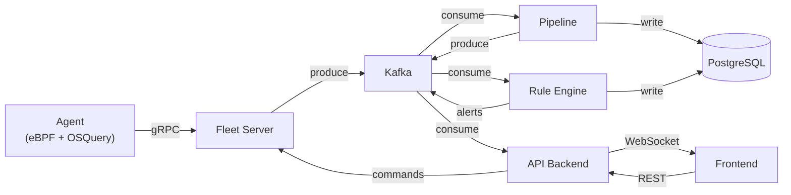

# project-edr

An indigenous Endpoint Detection and Response system built from scratch.

## What is this

A real-time EDR that monitors endpoints for suspicious activity, streams telemetry to a central server, runs detection rules, and surfaces alerts to a security operator through a live dashboard.

## Tech Stack

| Layer | Tech |
|---|---|
| Agent | Rust, eBPF (aya), OSQuery |
| Fleet Server | Rust, gRPC (tonic), PostgreSQL |
| Message Bus | Apache Kafka |
| Pipeline | Rust, rdkafka, sqlx |
| Rule Engine | Rust, YARA (yara-x) |
| API | Rust, Axum, WebSocket |
| Frontend | React, TypeScript, Vite |
| Infra | Docker Compose, Kubernetes |

## Architecture



## Structure

```
sdk/             shared types, proto definitions
agent/           endpoint agent (cargo workspace, 6 crates)
fleet-server/    gRPC server for agent enrollment + streaming
kafka-pipeline/  event normalisation + DB persistence
rule-engine/     YARA scanning + MITRE ATT&CK mapping
api-backend/     REST API + WebSocket for dashboard
frontend/        React operator dashboard
infra/           docker-compose, k8s, terraform
```

## Getting Started

```bash
# Start infrastructure
cd infra && docker-compose up -d

# Build all Rust services
cargo build --workspace

# Run a specific service
cargo run -p edr-fleet-server
```

## Docs

- [Implementation Guide](EDR_IMPLEMENTATION_GUIDE.md)
- [Timeline](TIMELINE.md)
- [Test Plan](tests/TEST_PLAN.md)
contribution test by Parnavi

