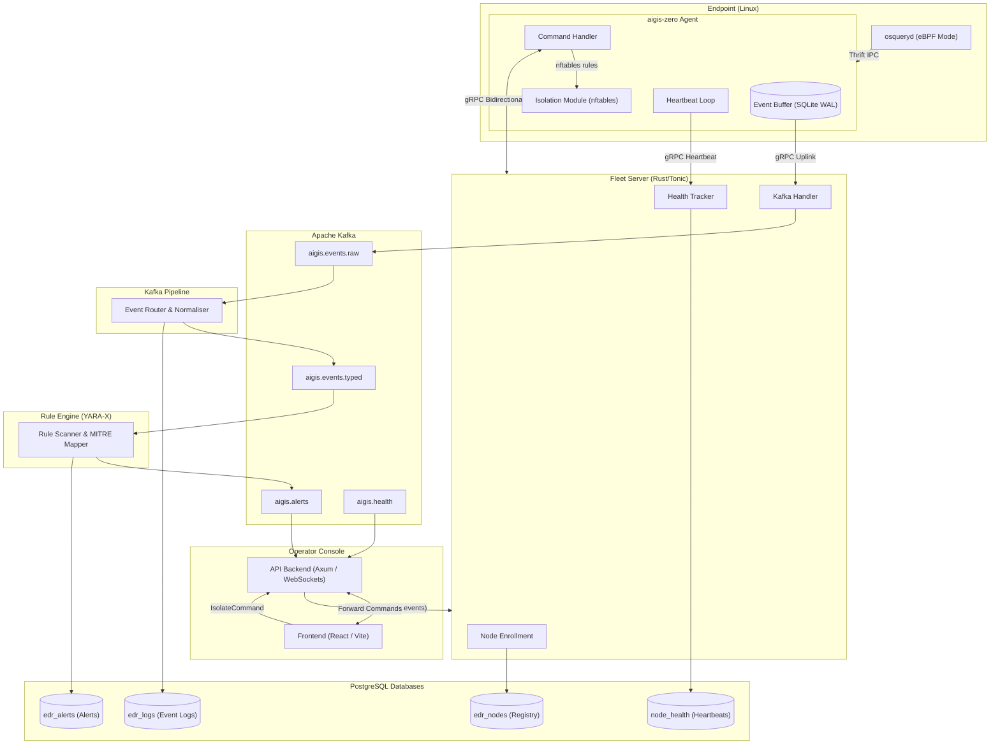

# Aigis-Zero : Endpoint Detection and Response

Aigis-Zero is a open-source EDR system built entirely from scratch in Rust. It monitors Linux endpoints for suspicious activity in real time, streams telemetry through a central fleet server, normalises and routes events via Apache Kafka, runs detection rules against a YARA engine, MITRE ATT&CK mapping, and ML based detection. It surfaces alerts to SOC team through a live React dashboard.


Most production EDR agents are written in C, C++, or Go. This project makes a deliberate choice of Rust for every backend component and the agent itself.

While C/C++ EDR agents are notoriously prone to memory corruption (a massive liability for a root-level service), and Go-based agents struggle with garbage collection pauses and heavy memory bloat under burst load, Rust gives us the best of both worlds. 

We get the raw, low-overhead performance of C/C++ without the security risks of buffer overflows or use-after-free bugs. At the same time, we get the concurrency of Go but without a heavy runtime or unpredictable GC sweeps that drop event streams. By leveraging Tokio's async engine, the agent handles thousands of concurrent event streams on a razor-thin memory footprint.


---

## Architecture

---

## Component Breakdown

The codebase is organized as a single Cargo workspace containing 18 crates that separate the core services, the shared SDK, and the React frontend.

*   **sdk** — Shared Protobuf definitions (`agent.proto`, `events.proto`, `fleet.proto`) and common domain models. All other crates import from here. Strictly no business logic allowed.
*   **agent** — A single compiled binary (`aigis-zero`) composed of 7 sub-crates:
    *   `agent-bin`: Bootstrap entry point, CLI config loader, and service lifecycle manager.
    *   `agent-core`: Tokio-backed orchestrator, backpressure-aware event loop, and exponential backoff retry loop (50ms base, ~12.8s max).
    *   `osquery-client`: Thrift IPC client interfacing with osqueryd via Unix sockets.
    *   `event-buffer`: SQLite-backed write-ahead log ensuring at-least-once telemetry delivery during network partitions.
    *   `fleet-client`: gRPC client managing Tonic bidirectional streams and heartbeats.
    *   `isolation`: Host quarantine control managing nftables drop rules with a fleet IP exemption.
    *   `agent-tracing`: Structured JSON telemetry logging using the `tracing` ecosystem.
*   **fleet-server** — Central fleet controller split into 8 crates:
    *   `fleet-server-bin`: Entry point, env loading (`dotenvy`), DB schema migrations, and Tonic server initialization.
    *   `grpc-listener`: Implementation of the gRPC `FleetService` interface.
    *   `node-enrollment`: Enrollment handler verifying nodes, issuing 24h JWTs, and recording registration state.
    *   `health-tracker`: Records node heartbeat timelines; isolates heartbeat state so agents can't overwrite quarantine flags.
    *   `fleet-manager`: Pure domain logic governing agent state machines and transitions.
    *   `kafka-handler`: Stream producer piping raw telemetry from agents directly into Kafka.
    *   `postgres-interface`: Data-access layer using `sqlx` with compile-time checked SQL and pessimistic locks (`SELECT FOR UPDATE`) for safe upserts.
    *   `fleet-tracing`: Shared logging initialization for the fleet server.
*   **kafka-pipeline** — Dedicated pipeline consumer pulling from `aigis.events.raw`, mapping events to typed topics by class, and saving normalized data into `edr_logs` (using LZ4 compression and 5ms batching).
*   **rule-engine** — Event scanner checking normalized streams against YARA-X rules, indexing detections with MITRE ATT&CK codes, and publishing alerts to `aigis.alerts`. (Currently in active development).
*   **api-backend** — Axum-based web gateway serving REST endpoints and managing live WebSocket connections for dashboard operators.
*   **frontend** — React operator console built with TypeScript and Vite. Currently supports authentication, node tracking, and live alert feeds via Mock data.
*   **infra** — Docker Compose manifests for KRaft/Zookeeper Kafka stacks and Postgres setups, along with Kubernetes deployment specs.

---

## Feature Overview

**Agent**
- Scheduled osquery polling with query intervals loaded from the fleet server via `ConfigUpdateCommand`
- SQLite write-ahead event buffer that survives network outages and agent restarts; configurable max-size with oldest-first eviction under pressure
- Bidirectional gRPC stream to fleet-server with exponential backoff reconnection
- Heartbeat loop reporting node status and buffered event count
- Fleet-commanded network isolation via nftables: drop-all policy with a single outbound carve-out for the fleet-server IP
- Structured JSON logging with per-component log level control
- Musl static binary for production deployment — zero glibc dependency, runs on any Linux kernel >= 4.18
- Cross-compiled release artifacts for `x86_64` and `aarch64` via GitHub Actions

**Fleet Server**
- gRPC enrollment with 24-hour JWT token issuance
- Compile-time SQL verification via `sqlx` — schema mismatches fail at build time, not at runtime
- Strict `operator_status` / `agent_status` separation: heartbeats cannot overwrite operator-assigned quarantine states
- Time-series heartbeat tracking per node
- Kafka event forwarding with LZ4 compression

**Kafka Pipeline**
- Type-aware event routing to dedicated topics per event class (process, file, network, auth)
- Consumer group management with graceful shutdown via `CancellationToken`

**Rule Engine**
- YARA-X based scanning — pure Rust, no `libyara` C dependency
- MITRE ATT&CK technique and tactic mapping on alert records
- Structured `Alert` with threat score, severity, source, and triggering event reference

**Infrastructure**
- Three isolated PostgreSQL databases for node registry, event logs, and alerts
- Kafka with 12-partition event topics and 4-partition alert/health topics
- Kafka UI on port 8090 for local debugging
- Dev-mode KRaft Kafka (no Zookeeper) for faster local iteration
- Kubernetes manifests for fleet-server and supporting services

---

## Current State

Active development is on the `agent/bug-fixes-01` branch. This is the branch with the most commits and the most complete implementation across all components.

| Component | Status |
|---|---|
| SDK (protobuf definitions, shared models) | Complete |
| Agent binary (osquery polling, gRPC, buffer) | Complete |
| Agent network isolation (nftables) | Complete |
| Agent enrollment and JWT auth | Complete |
| Agent heartbeat | Complete |
| Agent config hot-reload | Scaffold — fleet command delivery works; client-side application in progress |
| Fleet server (enrollment, health tracking, Kafka forwarding) | Complete |
| Kafka pipeline (event router) | Complete |
| Kafka pipeline (normalisation and DB persistence) | In progress |
| Rule engine (YARA-X scanning, alert production) | Stubbed — binary compiles; rule loading and alerting in progress |
| API backend (REST and WebSocket) | Stubbed — binary compiles; route implementation in progress |
| Frontend (login, node list, live events tab) | Functional with mock data; WebSocket integration in progress |
| eBPF collector (aya) | Excluded from default workspace; under development on a separate branch |
| mTLS (agent to fleet) | Scaffold — cert paths in config; TLS handshake not yet wired |
| Kubernetes production deployment | Manifests present; not production-validated |

The zero-warning policy is enforced: `cargo clippy --all-targets -- -D warnings` and `cargo fmt --check` must pass before any merge.

---

## Local Setup and Installation

### Prerequisites

| Tool | Minimum Version | Notes |
|---|---|---|
| Rust (stable) | 1.91 | Install via `rustup` |
| Docker and Docker Compose | Any recent | Required for the infra stack |
| Node.js | 18 | Required for frontend development |
| Linux kernel | 4.18 | Agent endpoint only; 5.10+ recommended |
| Architecture | x86_64 or aarch64 | Agent only |
| osquery | 5.23.0 | Agent endpoint only; installed by `install.sh` |

---

### 1. Infrastructure

```bash
git clone -b agent/bug-fixes-01 https://github.com/swar09/project-edr.git
cd project-edr

cp .env.example .env
# Set POSTGRES_PASSWORD and any other required values in .env

cd infra
docker compose up -d
docker compose ps
```

`kafka-init` creates the required topics automatically on first start. Kafka UI is available at `http://localhost:8090`.

| Topic | Partitions | Purpose |
|---|---|---|
| `aigis.events.raw` | 12 | Raw agent telemetry |
| `aigis.events.norm` | 12 | Normalised events |
| `aigis.alerts` | 4 | Detection alerts |
| `aigis.health` | 4 | Node health |

| Database | Host Port | Purpose |
|---|---|---|
| `edr_nodes` | 5433 | Node registry, enrollment, health |
| `edr_logs` | 5432 | Normalised event log |
| `edr_alerts` | 5434 | Detection alerts |

For lightweight local development (KRaft Kafka, no Zookeeper):

```bash
docker compose -f infra/docker-compose.dev.yml up -d
```

---

### 2. Building the Workspace

`sqlx` performs compile-time query verification and requires `DATABASE_URL` to point to a live, migrated database.

```bash
export DATABASE_URL=postgres://edr:<password>@localhost:5433/edr_nodes

cargo build --workspace
cargo build --release --workspace
```

To build against cached sqlx metadata without a live database:

```bash
export SQLX_OFFLINE=true
cargo build --workspace
```

CI checks:

```bash
cargo fmt --all -- --check
cargo clippy --workspace --all-targets -- -D warnings
cargo test --workspace
```

---

### 3. Agent Installation

The agent runs on Linux endpoints and requires root.

#### Method A: Pre-built Musl Binary (Recommended)

```bash
VERSION=agent-v0.1.0
ARCH=$(uname -m)

curl -fsSL \
  "https://github.com/swar09/project-edr/releases/download/${VERSION}/aigis-zero-agent-linux-${ARCH}.tar.gz" \
  -o aigis-zero-agent.tar.gz

tar -xzf aigis-zero-agent.tar.gz
cd aigis-zero-agent

sudo bash install.sh
```

The installer handles osquery installation, directory setup, systemd unit registration, kernel tunables, and ulimits in a single run. See the `agent/INSTALLATION_GUIDE.md` for the full step-by-step breakdown.

#### Method B: Build from Source

Verify kernel prerequisites on the target endpoint:

```bash
uname -r   # >= 4.18 required, >= 5.10 recommended

grep -E "CONFIG_BPF=y|CONFIG_BPF_SYSCALL=y" /boot/config-$(uname -r) 2>/dev/null || \
  zcat /proc/config.gz 2>/dev/null | grep -E "CONFIG_BPF=y|CONFIG_BPF_SYSCALL=y"

ls /sys/kernel/btf/vmlinux && echo "BTF present"
```

Disable auditd (required — auditd and osquery compete for the audit netlink socket, which only allows one consumer):

```bash
sudo systemctl stop auditd 2>/dev/null || true
sudo systemctl mask auditd 2>/dev/null || true
sudo systemctl mask --now systemd-journald-audit.socket
```

Install build dependencies:

```bash
# Debian/Ubuntu
sudo apt-get update
sudo apt-get install -y \
  build-essential pkg-config libssl-dev \
  libsystemd-dev libaudit-dev libcap-dev \
  util-linux musl-tools

# RHEL/Rocky/Fedora
sudo dnf install -y \
  gcc pkg-config openssl-devel \
  audit-libs-devel systemd-devel \
  util-linux-devel libcap-devel
```

Install Rust:

```bash
curl --proto '=https' --tlsv1.2 -sSf https://sh.rustup.rs | sh
source "$HOME/.cargo/env"
rustc --version   # should be stable >= 1.91
```

Build the agent:

```bash
# Native build (linked against system glibc)
cargo build --release --bin edr-agent

# Musl static build (recommended for production)
rustup target add x86_64-unknown-linux-musl
cargo build --release --target x86_64-unknown-linux-musl --bin edr-agent

# aarch64 musl (requires cross)
cargo install cross --git https://github.com/cross-rs/cross
cross build --release --target aarch64-unknown-linux-musl --bin edr-agent
```

Install osquery 5.23.0:

```bash
curl -fsSL https://pkg.osquery.io/linux/osquery-5.23.0_1.linux_x86_64.tar.gz \
  -o osquery-5.23.0_1.linux_x86_64.tar.gz
sudo tar -xzf osquery-5.23.0_1.linux_x86_64.tar.gz -C /

sudo tee /etc/systemd/system/osqueryd.service << 'EOF'
[Unit]
Description=The osquery Daemon
After=network.target syslog.target

[Service]
Type=simple
TimeoutStartSec=0
ExecStartPre=/bin/mkdir -p /run/osquery
ExecStart=/usr/bin/osqueryd \
  --flagfile=/etc/osquery/osquery.flags \
  --config_path=/etc/osquery/osquery.conf
Restart=on-failure
KillMode=control-group

[Install]
WantedBy=multi-user.target
EOF
```

Install the agent binary, directories, configs, and systemd units:

```bash
sudo install -o root -g root -m 0755 \
  target/x86_64-unknown-linux-musl/release/edr-agent \
  /usr/sbin/aigis-zero

sudo mkdir -p /etc/aigis-zero /var/lib/aigis-zero /var/log/aigis-zero
sudo chmod 700 /etc/aigis-zero /var/lib/aigis-zero
sudo chmod 755 /var/log/aigis-zero

sudo install -o root -g root -m 640 agent/agent.toml /etc/aigis-zero/config.toml
# Edit config to set the fleet server host and port
sudo nano /etc/aigis-zero/config.toml

sudo install -o root -g root -m 644 \
  agent/sysctl/60-aigis-zero.conf /etc/sysctl.d/
sudo sysctl --system

sudo install -o root -g root -m 644 \
  agent/limits/99-aigis-zero.conf /etc/security/limits.d/

sudo mkdir -p /etc/osquery /var/osquery /var/log/osquery /run/osquery
sudo chmod 755 /etc/osquery && sudo chmod 750 /var/osquery && sudo chmod 755 /var/log/osquery /run/osquery

sudo install -o root -g root -m 644 agent/osquery/osquery.conf /etc/osquery/osquery.conf
sudo install -o root -g root -m 644 agent/osquery/osquery.flags /etc/osquery/osquery.flags
sudo touch /etc/osquery/extensions.load && sudo chmod 644 /etc/osquery/extensions.load

sudo install -o root -g root -m 644 \
  agent/systemd/aigis-zero.service /etc/systemd/system/

sudo mkdir -p /etc/systemd/system/osqueryd.service.d
sudo install -o root -g root -m 644 \
  agent/systemd/osqueryd.service.d/aigis-zero.conf \
  /etc/systemd/system/osqueryd.service.d/aigis-zero.conf

sudo systemctl daemon-reload
sudo systemctl enable osqueryd aigis-zero
sudo systemctl start osqueryd
sudo systemctl start aigis-zero

sudo systemctl status osqueryd
sudo systemctl status aigis-zero
```

Agent configuration reference (`/etc/aigis-zero/config.toml`):

```toml
[agent]
log_level = "info"                      # trace | debug | info | warn | error
log_format = "json"                     # json | human
log_dir = "/var/log/aigis-zero"
data_dir = "/var/lib/aigis-zero"
event_buffer_db = "/var/lib/aigis-zero/events.db"
event_buffer_max = 500000               # max buffered events before oldest-drop
event_drain_batch = 100
event_drain_interval_secs = 5

[osquery]
socket_path = "/var/osquery/osquery.em"
conf_path = "/etc/osquery/osquery.conf"
flags_path = "/etc/osquery/osquery.flags"
connect_timeout_secs = 30
query_timeout_secs = 60

[fleet]
host = "<fleet-server-ip>"
port = 50051
heartbeat_interval_secs = 60
reconnect_interval_secs = 10
max_reconnect_attempts = 0             # 0 = retry forever

[isolation]
enabled = false                        # toggled by fleet-server IsolateCommand
```

Service management:

```bash
# Both services are fully independent — stopping one does not affect the other
systemctl status osqueryd
systemctl status aigis-zero

journalctl -u osqueryd -f
journalctl -u aigis-zero -f

systemctl stop osqueryd     # aigis-zero continues buffering normally
systemctl stop aigis-zero   # osqueryd continues collecting normally
```

Uninstall:

```bash
# Method A: using the installer script
sudo bash uninstall.sh
sudo bash uninstall.sh --remove-osquery --purge-logs   # full purge

# Method B: manual
sudo systemctl stop aigis-zero osqueryd
sudo systemctl disable aigis-zero osqueryd
sudo rm -f /usr/sbin/aigis-zero
sudo rm -rf /etc/aigis-zero /var/lib/aigis-zero
sudo rm -f /etc/systemd/system/aigis-zero.service
sudo rm -f /etc/systemd/system/osqueryd.service.d/aigis-zero.conf
sudo rm -f /etc/sysctl.d/60-aigis-zero.conf
sudo rm -f /etc/security/limits.d/99-aigis-zero.conf
sudo rm -f /etc/osquery/osquery.conf /etc/osquery/osquery.flags /etc/osquery/extensions.load
sudo rm -rf /var/osquery /run/osquery
sudo systemctl daemon-reload
```

Troubleshooting:

| Symptom | Likely cause | Resolution |
|---|---|---|
| `osqueryd: perf_event_open failed` | eBPF not enabled or kernel too old | Verify `uname -r` >= 4.18 and `CONFIG_BPF_SYSCALL=y` |
| `file_events` table returns empty | inotify watch limit too low | `sudo sysctl -w fs.inotify.max_user_watches=524288` |
| `aigis-zero: connection refused` on osquery socket | osqueryd still starting | Wait for `Extension manager started` in `journalctl -u osqueryd` |
| `Permission denied on /var/osquery` | Directory ownership incorrect | `sudo chown -R root:root /etc/osquery /var/osquery && sudo chmod 750 /var/osquery` |
| `cargo build` fails, `DATABASE_URL not set` | sqlx compile-time check | Export `DATABASE_URL` pointing to the nodes DB or set `SQLX_OFFLINE=true` |

---

### 4. Running Services

```bash
# Fleet server
export DATABASE_URL=postgres://edr:<password>@localhost:5433/edr_nodes
export KAFKA_BROKERS=localhost:29092
cargo run -p fleet-server-bin

# Kafka pipeline
export KAFKA_BROKERS=localhost:29092
cargo run -p kafka-pipeline

# Rule engine (stub)
cargo run -p rule-engine

# API backend (stub)
cargo run -p api-backend
```

---

### 5. Frontend

```bash
cd frontend
npm install
npm run dev       # development server at http://localhost:5173
npm run build     # production build to frontend/dist/
```

---

## Upcoming Features

**mTLS (agent to fleet-server).** The config scaffolding and cert paths exist in `agent.toml` and the fleet-server settings. The next step is wiring the TLS handshake in the Tonic channel builder on the agent side and configuring `tonic` server TLS on the fleet side. The design target is enrollment-issued certificates: each agent gets a short-lived cert signed by the fleet CA during `RegisterAgent`.

**eBPF collector.** The `agent/crates/ebpf-collector` crate is excluded from the default workspace build because it requires a kernel with BTF and the `aya` build toolchain. When this ships, the agent will collect process, network, and filesystem events directly from the kernel via eBPF programs, removing the dependency on osquery's audit-based collection and lifting the single-consumer constraint on the audit netlink socket.

**Rule engine full implementation.** YARA-X rule loading from the filesystem, consumer group wiring, alert production to `aigis.alerts`, and PostgreSQL persistence. The binary compiles; the business logic is the active workstream.

**API backend routes.** Full REST surface: node listing, node detail, alert query with filtering by severity and MITRE technique, and node isolation command forwarding to the fleet-server. WebSocket handler for live event streaming.

**Frontend WebSocket integration.** The dashboard shell is in place. Connecting it to the api-backend WebSocket for live node status and alert feed is the active frontend workstream.

**Kafka normalisation and DB persistence.** The event router is live. The next stage is the normalisation processor: consuming from typed topics, deserialising event payloads, and writing structured rows to `edr_logs`.

**ML-based anomaly detection.** The `Alert` proto already carries a `source` field for `ml_model`. A future workstream will add a statistical baseline model for process execution frequency and network behaviour, producing anomaly alerts alongside YARA rule hits.

**Enrollment secret validation.** The `enrollment_secret` field exists in `agent.toml` and the `RegisterRequest` proto. Fleet-server-side validation is not yet implemented.

**Multi-tenancy.** The current data model is single-tenant. Organisation-scoped node isolation and role-based operator access are planned.

**Windows agent.** The current agent is Linux-only. Windows support via ETW (Event Tracing for Windows) is on the long-term roadmap with no scheduled timeline.

---

## References

- [osquery documentation](https://osquery.readthedocs.io/)
- [aya — eBPF for Rust](https://aya-rs.dev/)
- [Tonic — gRPC for Rust](https://github.com/hyperium/tonic)
- [YARA-X](https://github.com/VirusTotal/yara-x)
- [MITRE ATT&CK Framework](https://attack.mitre.org/)
- [Apache Kafka documentation](https://kafka.apache.org/documentation/)
- [sqlx — async Rust SQL](https://github.com/launchbadge/sqlx)
- [Axum — async web framework](https://github.com/tokio-rs/axum)
- [rdkafka — Rust Kafka client](https://github.com/fede1024/rust-rdkafka)
- [nftables documentation](https://wiki.nftables.org/)
- [Tokio async runtime](https://tokio.rs/)

---

## License

This project is licensed under the [MIT License](LICENSE).

```
MIT License

Copyright (c) 2025 Swar (@swar09)

Permission is hereby granted, free of charge, to any person obtaining a copy
of this software and associated documentation files (the "Software"), to deal
in the Software without restriction, including without limitation the rights
to use, copy, modify, merge, publish, distribute, sublicense, and/or sell
copies of the Software, and to permit persons to whom the Software is
furnished to do so, subject to the following conditions:

The above copyright notice and this permission notice shall be included in all
copies or substantial portions of the Software.

THE SOFTWARE IS PROVIDED "AS IS", WITHOUT WARRANTY OF ANY KIND, EXPRESS OR
IMPLIED, INCLUDING BUT NOT LIMITED TO THE WARRANTIES OF MERCHANTABILITY,
FITNESS FOR A PARTICULAR PURPOSE AND NONINFRINGEMENT. IN NO EVENT SHALL THE
AUTHORS OR COPYRIGHT HOLDERS BE LIABLE FOR ANY CLAIM, DAMAGES OR OTHER
LIABILITY, WHETHER IN AN ACTION OF CONTRACT, TORT OR OTHERWISE, ARISING FROM,
OUT OF OR IN CONNECTION WITH THE SOFTWARE OR THE USE OR OTHER DEALINGS IN THE
SOFTWARE.
```

---

## Contributing

Contributions are welcome. The bar is: zero clippy warnings, code formatted with `rustfmt`, and all tests passing.

Before opening a pull request:

```bash
cargo fmt --all
cargo clippy --workspace --all-targets -- -D warnings
cargo test --workspace
```

For non-trivial changes, open an issue first to align on the approach. Changes to the agent, fleet-server auth paths, or the isolation module warrant design discussion before implementation — these components touch the security-critical surface area of the system.

Branch naming:
- `feat/<short-description>` for new features
- `fix/<short-description>` for bug fixes
- `chore/<short-description>` for dependency updates, tooling, CI
- `agent/<short-description>` for agent-specific work

The `main` branch is the stable reference. Active development happens on feature branches and is merged via pull request.

---

## Contributors

<table>
  <tr>
    <td align="center">
      <a href="https://github.com/swar09">
        <br/>
        <sub><b>Swar</b></sub><br/>
        <sub>@swar09</sub><br/>
        <sub>Author &amp; Maintainer</sub>
      </a>
    </td>
  </tr>
</table>

---

*Crafted in Rust. Full-stack ownership, zero compromise.*
