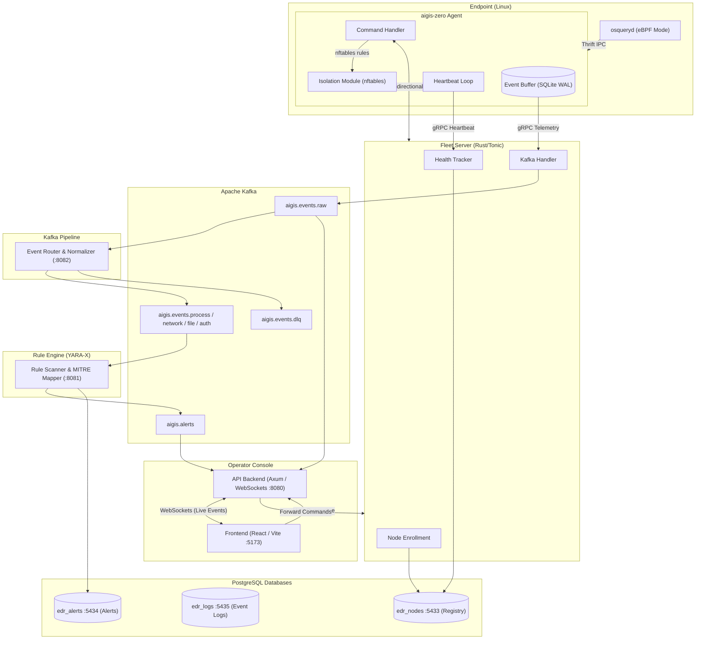

# aigis-zero

Open-source endpoint detection and response (EDR) platform written in Rust. Monitors Linux endpoints for suspicious activity in real time, streams telemetry through a central fleet server, normalizes and routes events with Apache Kafka, evaluates detection rules against a YARA-X engine with MITRE ATT&CK mapping, and presents alerts on a React operator dashboard.

Rust runs across all backend services and the endpoint daemon, providing predictable memory usage without garbage collection pauses and eliminating memory safety vulnerabilities in privileged endpoint code.

## architecture


```mermaid
graph TD
    %% Endpoint Section
    subgraph EP ["Endpoint (Linux)"]
        OQ["osqueryd (eBPF Mode)"]
        
        subgraph AZ ["aigis-zero Agent"]
            EB[("Event Buffer (SQLite WAL)")]
            CH["Command Handler"]
            ISO["Isolation Module (nftables)"]
            HL["Heartbeat Loop"]
        end
    end

    %% Fleet Server Section
    subgraph FS ["Fleet Server (Rust/Tonic)"]
        NE["Node Enrollment"]
        KH["Kafka Handler"]
        HT["Health Tracker"]
    end

    %% Databases
    subgraph DBs ["PostgreSQL Databases"]
        DB_Nodes[("edr_nodes :5433 (Registry)")]
        DB_Logs[("edr_logs :5435 (Event Logs)")]
        DB_Alerts[("edr_alerts :5434 (Alerts)")]
    end

    %% Kafka
    subgraph KF ["Apache Kafka"]
        K_Raw["aigis.events.raw"]
        K_Typed["aigis.events.process / network / file / auth"]
        K_Alerts["aigis.alerts"]
        K_DLQ["aigis.events.dlq"]
    end

    %% Kafka Pipeline
    subgraph KP ["Kafka Pipeline"]
        Router["Event Router & Normalizer (:8082)"]
    end

    %% Rule Engine
    subgraph RE ["Rule Engine (YARA-X)"]
        Scanner["Rule Scanner & MITRE Mapper (:8081)"]
    end

    %% API Backend & Frontend
    subgraph Operator ["Operator Console"]
        API["API Backend (Axum / WebSockets :8080)"]
        UI["Frontend (React / Vite :5173)"]
    end

    %% Communication Flows
    OQ -->|"Thrift IPC"| AZ
    EB -->|"gRPC Telemetry"| KH
    HL -->|"gRPC Heartbeat"| HT
    CH <-->|"gRPC Bidirectional Stream"| FS
    CH -->|"nftables rules"| ISO

    %% Fleet Server DB writes
    NE --> DB_Nodes
    HT --> DB_Nodes

    %% Kafka handling
    KH --> K_Raw
    K_Raw --> Router
    Router --> K_Typed
    Router --> K_DLQ

    %% Rule scanning
    K_Typed --> Scanner
    Scanner --> K_Alerts
    Scanner --> DB_Alerts

    %% API and Dashboard
    K_Alerts --> API
    K_Raw --> API
    API <-->|"WebSockets (Live Events)"| UI
    UI -->|"Host Quarantine"| API
    API -->|"Forward Commands"| FS
```

## workspace layout

The repository is organized as a Cargo workspace with dedicated subsystems:

- [`agent/`](agent/README.md): Linux endpoint telemetry agent, SQLite WAL event buffer, and nftables host isolation.
- [`fleet-server/`](fleet-server/README.md): Tonic gRPC controller handling node enrollment, authentication, and Kafka ingestion.
- [`kafka-pipeline/`](kafka-pipeline/README.md): Event router and normalizer fanning raw telemetry into typed topics.
- [`rule-engine/`](rule-engine/README.md): Pure-Rust YARA-X scanning, MITRE ATT&CK taxonomy enrichment, and deduplication.
- [`api-backend/`](api-backend/README.md): Axum 0.8 REST gateway, diesel-async connection pooling, and WebSocket live feeds.
- [`frontend/`](frontend/README.md): React and TypeScript operator console for node management and alert triage.
- [`sdk/`](sdk/): Shared Protobuf definitions (`.proto`) and domain models across all services.
- [`infra/`](infra/README.md): Docker Compose configurations for Kafka, Zookeeper, and isolated PostgreSQL databases.

## prerequisites

| Tool | Minimum Version | Notes |
|---|---|---|
| Rust (stable & nightly) | 1.91+ | Nightly required for rustfmt import grouping |
| Docker & Docker Compose | Recent | Required for databases and Kafka cluster |
| Node.js | 18+ | Required for frontend dashboard |
| Linux kernel | 4.18+ | Required for endpoint agent (eBPF and nftables) |

To install all system libraries and developer tooling on macOS or Linux:

```bash
./scripts/setup.sh
```

## quick start

### 1. boot infrastructure

Start PostgreSQL databases, Kafka cluster, Kafka UI, and seed initial database fixtures with one command:

```bash
./scripts/infra.sh up
```

Service web endpoints:
- Kafka UI: [http://localhost:8090](http://localhost:8090)
- Nodes PostgreSQL: `localhost:5433` (db: `edr_nodes`, user: `edr`)
- Alerts PostgreSQL: `localhost:5434` (db: `edr_alerts`, user: `edr`)
- Logs PostgreSQL: `localhost:5435` (db: `edr_logs`, user: `edr`)

### 2. fetch detection rules

Download community YARA detection rules and the MITRE Enterprise ATT&CK taxonomy:

```bash
./scripts/fetch-rules.sh
```

### 3. run backend services

In separate terminal sessions (or using Docker Compose):

```bash
# Terminal 1: Fleet Server (gRPC :50051)
cargo run -p fleet-server-bin

# Terminal 2: Kafka Normalization Pipeline (:8082)
cargo run -p edr-kafka-pipeline

# Terminal 3: YARA-X Rule Engine (:8081)
cargo run -p edr-rule-engine

# Terminal 4: API Backend (REST & WebSocket :8080)
cargo run -p edr-api-backend
```

### 4. start the frontend console

```bash
cd frontend
npm install
npm run dev
```

The SOC console opens at [http://localhost:5173](http://localhost:5173). Default operator login: `admin` / `admin`.

### 5. deploy endpoint agent

Refer to the [Agent Documentation](agent/README.md) for endpoint installation methods, osquery configuration, and systemd service management.

## development and quality gates

All commits must pass the mandatory quality checks:

```bash
# Run formatting, clippy with zero warnings, typos, and test suite
./scripts/check.sh

# Run check with automated formatting fixes
./scripts/check.sh --fix

# Run CI mirror checks
./scripts/ci.sh
```

Run tests individually:

```bash
cargo test --workspace --all-features
```

## scripts reference

| Script | Purpose |
|---|---|
| `scripts/check.sh` | Runs nightly rustfmt, clippy (`-D warnings`), typos, cargo build, and full test suite. |
| `scripts/ci.sh` | Strict GitHub Actions CI simulation including cargo audit and doc tests. |
| `scripts/setup.sh` | Cross-platform dependency installer for Linux and macOS. |
| `scripts/infra.sh` | Boots, seeds, checks health, or tears down Docker containers (`up`, `down`, `reset`, `seed`, `status`). |
| `scripts/seed.sh` | Reapplies database migrations and mock test fixtures. |
| `scripts/fetch-rules.sh` | Downloads community YARA signatures and MITRE STIX JSON data. |
| `scripts/clean.sh` | Cleans build artifacts and cargo caches. |

## license

This project is licensed under the [MIT License](LICENSE).
