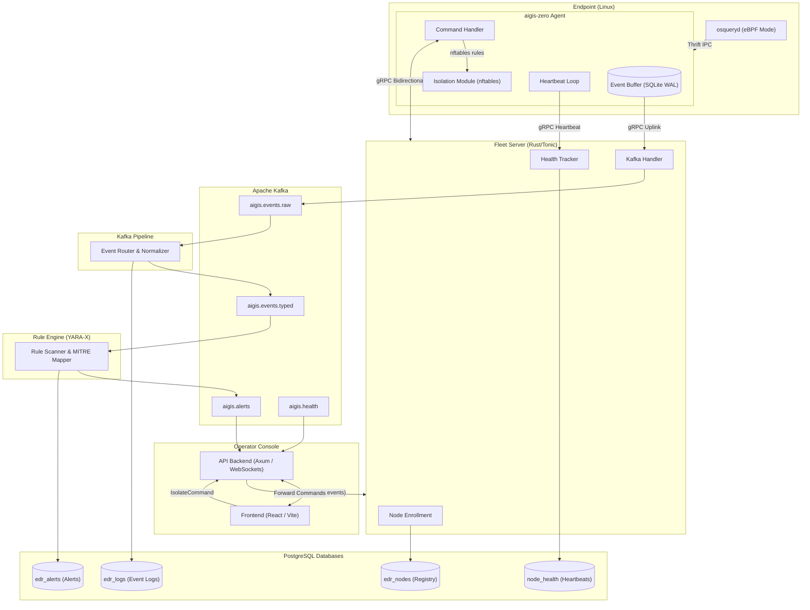

# Aigis-Zero : Endpoint Detection and Response

Aigis-Zero is an open-source EDR system written in Rust. It monitors Linux endpoints for suspicious activity in real time, streams telemetry through a central fleet server, normalizes and routes events with Apache Kafka, evaluates detection rules against a YARA-X engine with MITRE ATT&CK mapping, and presents alerts on a React dashboard.

The system uses Rust across every backend service and on the endpoint agent. This gives the agent low overhead and predictable memory usage without garbage collection pauses, while avoiding memory corruption vulnerabilities in root-level endpoint services. Tokio powers the async event loop across all services.

---

## architecture


```mermaid
graph TD
    %% Endpoint Section
    subgraph EP ["Endpoint (Linux)"]
        OQ["osqueryd (eBPF Mode)"]
        
        subgraph AZ ["aigis-zero Agent"]
            EB[("Event Buffer (SQLite WAL)")]
            CH["Command Handler"]
            ISO["Isolation Module (nftables)"]
            HL["Heartbeat Loop"]
        end
    end

    %% Fleet Server Section
    subgraph FS ["Fleet Server (Rust/Tonic)"]
        NE["Node Enrollment"]
        KH["Kafka Handler"]
        HT["Health Tracker"]
    end

    %% Databases
    subgraph DBs ["PostgreSQL Databases"]
        DB_Nodes[("edr_nodes (Registry)")]
        DB_Health[("node_health (Heartbeats)")]
        DB_Logs[("edr_logs (Event Logs)")]
        DB_Alerts[("edr_alerts (Alerts)")]
    end

    %% Kafka
    subgraph KF ["Apache Kafka"]
        K_Raw["aigis.events.raw"]
        K_Typed["aigis.events.typed"]
        K_Alerts["aigis.alerts"]
        K_Health["aigis.health"]
    end

    %% Kafka Pipeline
    subgraph KP ["Kafka Pipeline"]
        Router["Event Router & Normalizer"]
    end

    %% Rule Engine
    subgraph RE ["Rule Engine (YARA-X)"]
        Scanner["Rule Scanner & MITRE Mapper"]
    end

    %% API Backend & Frontend
    subgraph Operator ["Operator Console"]
        API["API Backend (Axum / WebSockets)"]
        UI["Frontend (React / Vite)"]
    end

    %% Communication Flows
    OQ -->|"Thrift IPC"| AZ
    EB -->|"gRPC Uplink"| KH
    HL -->|"gRPC Heartbeat"| HT
    CH <-->|"gRPC Bidirectional Stream"| FS
    CH -->|"nftables rules"| ISO

    %% Fleet Server DB writes
    NE --> DB_Nodes
    HT --> DB_Health

    %% Kafka handling
    KH --> K_Raw
    K_Raw --> Router
    Router --> K_Typed
    Router --> DB_Logs

    %% Rule scanning
    K_Typed --> Scanner
    Scanner --> K_Alerts
    Scanner --> DB_Alerts

    %% API and Dashboard
    K_Alerts --> API
    K_Health --> API
    API <-->|"WebSockets (Live events)"| UI
    UI -->|"IsolateCommand"| API
    API -->|"Forward Commands"| FS
```

---

## component breakdown

The codebase is organized as a Cargo workspace with 18 crates separating services, the shared SDK, and the React frontend:

* `sdk`: Shared Protobuf definitions (`agent.proto`, `events.proto`, `fleet.proto`) and common domain models. All crates import from here. No business logic.
* `agent`: Endpoint binary (`aigis-zero`) composed of 7 sub-crates:
  * `agent-bin`: Bootstrap entry point, CLI config loader, and service lifecycle manager.
  * `agent-core`: Tokio orchestrator, backpressure-aware event loop, and exponential backoff retry loop (50ms base, 12.8s max).
  * `osquery-client`: Thrift IPC client connecting to osqueryd over Unix sockets.
  * `event-buffer`: SQLite write-ahead log for at-least-once delivery during network partitions.
  * `fleet-client`: gRPC client managing Tonic bidirectional streams and heartbeats.
  * `isolation`: Host quarantine control using nftables drop rules with a fleet server IP exemption.
  * `agent-tracing`: Structured JSON telemetry logging with tracing subscriber.
* `fleet-server`: Fleet controller split into 8 crates:
  * `fleet-server-bin`: Entry point, env loading, schema migrations, and Tonic server initialization.
  * `grpc-listener`: gRPC `FleetService` implementation.
  * `node-enrollment`: Enrollment handler verifying nodes, issuing 24h JWTs, and tracking registration.
  * `health-tracker`: Records node heartbeat timelines and protects operator-assigned quarantine status.
  * `fleet-manager`: Domain logic governing agent state machine transitions.
  * `kafka-handler`: Stream producer sending telemetry from agents directly into Kafka.
  * `postgres-interface`: Data-access layer using `sqlx` with compile-time verified SQL and pessimistic row locks (`SELECT FOR UPDATE`).
  * `fleet-tracing`: Shared logging initialization for the fleet server.
* `kafka-pipeline`: Pipeline consumer pulling from `aigis.events.raw`, mapping events to typed topics, and saving normalized data into `edr_logs` (LZ4 compression, 5ms batching).
* `rule-engine`: Event scanner checking normalized streams against YARA-X rules, indexing detections with MITRE ATT&CK codes, and publishing alerts to `aigis.alerts`.
* `api-backend`: Axum 0.8 web gateway with Diesel-Async connection pooling, REST endpoints, and WebSocket real-time event streaming.
* `frontend`: React operator console built with TypeScript and Vite for node management, alert triage, and live telemetry feeds.
* `infra`: Docker Compose manifests for Kafka and PostgreSQL setups, along with Kubernetes deployment specs.

---

## feature overview

### agent
- Scheduled osquery polling with query intervals loaded from fleet server via `ConfigUpdateCommand`
- SQLite write-ahead event buffer surviving network outages and restarts, with configurable max size and oldest-first eviction under pressure
- Bidirectional gRPC stream to fleet server with exponential backoff reconnection
- Heartbeat loop reporting node health and buffered event count
- Network isolation via nftables with drop-all policy and outbound exemption for the fleet server IP
- Structured JSON logging with per-component level control
- Musl static binary for deployment on Linux kernels 4.18 and newer
- Cross-compiled release artifacts for `x86_64` and `aarch64`

### fleet server
- gRPC enrollment with 24-hour JWT token issuance
- Compile-time SQL verification via `sqlx`
- Strict separation between `operator_status` and `agent_status` so heartbeats cannot overwrite quarantine flags
- Time-series heartbeat tracking per node
- Kafka event forwarding with LZ4 compression

### kafka pipeline
- Type-aware event routing to dedicated topics per event class (process, file, network, auth)
- Consumer group management with graceful shutdown via `CancellationToken`

### rule engine
- YARA-X scanning in pure Rust without `libyara` C dependencies
- MITRE ATT&CK technique and tactic mapping on alert records
- Structured `Alert` model with threat score, severity, source, and triggering event reference

### api backend
- REST endpoints for node inventory, network quarantine commands, detection alerts, and telemetry logs
- Type-safe database queries via `diesel-async` and `deadpool` across three isolated databases
- Live WebSocket feed (`/api/v1/ws`) multiplexing logs, alerts, and heartbeats with topic and node filters
- Fail-fast connection pool timeouts preventing request stalls under load

### infrastructure
- Three isolated PostgreSQL databases for node registry, event logs, and alerts
- Kafka with 12-partition event topics and 4-partition alert and health topics
- Kafka UI on port 8090 for local debugging
- Dev-mode KRaft Kafka configuration without Zookeeper
- Kubernetes manifests for fleet server and supporting services

---

## current state

Active development is on the `agent/bug-fixes-01` branch.

| Component | Status |
|---|---|
| SDK (protobuf definitions, shared models) | Complete |
| Agent binary (osquery polling, gRPC, buffer) | Complete |
| Agent network isolation (nftables) | Complete |
| Agent enrollment and JWT auth | Complete |
| Agent heartbeat | Complete |
| Agent config hot-reload | Scaffold (fleet command delivery works; client application in progress) |
| Fleet server (enrollment, health tracking, Kafka forwarding) | Complete |
| Kafka pipeline (event router) | Complete |
| Kafka pipeline (normalization and DB persistence) | In progress |
| Rule engine (YARA-X scanning, alert production) | Scaffold (binary compiles; rule loading and alerting in progress) |
| API backend (REST, Diesel-Async, WebSockets, Kafka consumer) | Complete |
| Frontend (login, node list, alert feeds) | Functional with mock data; WebSocket live feed integration in progress |
| eBPF collector (aya) | Separate branch; excluded from default workspace |
| mTLS (agent to fleet) | Scaffold (cert paths in config; handshake in progress) |
| Kubernetes production deployment | Manifests present |

Quality gates are enforced: `cargo clippy --workspace --all-targets --all-features -- -D warnings` and `cargo +nightly fmt --all -- --check` pass on all crates.

---

## local setup and installation

### prerequisites

| Tool | Minimum Version | Notes |
|---|---|---|
| Rust (stable) | 1.91 | Install via `rustup` |
| Docker and Docker Compose | Recent version | Required for the infra stack |
| Node.js | 18 | Required for frontend development |
| Linux kernel | 4.18 | Agent endpoint only; 5.10+ recommended |
| Architecture | x86_64 or aarch64 | Agent only |
| osquery | 5.23.0 | Agent endpoint only; installed by `install.sh` |

---

### 1. infrastructure

```bash
git clone -b agent/bug-fixes-01 https://github.com/swar09/project-edr.git
cd project-edr

cp .env.example .env
# Configure POSTGRES_PASSWORD and other settings in .env

cd infra
docker compose up -d
docker compose ps
```

`kafka-init` creates the required topics automatically on first start. Kafka UI is available at `http://localhost:8090`.

| Topic | Partitions | Purpose |
|---|---|---|
| `aigis.events.raw` | 12 | Raw agent telemetry |
| `aigis.events.norm` | 12 | Normalized events |
| `aigis.alerts` | 4 | Detection alerts |
| `aigis.health` | 4 | Node health |

| Database | Host Port | Purpose |
|---|---|---|
| `edr_nodes` | 5433 | Node registry, enrollment, health |
| `edr_logs` | 5432 | Normalized event log |
| `edr_alerts` | 5434 | Detection alerts |

For local development with KRaft Kafka (no Zookeeper):

```bash
docker compose -f infra/docker-compose.dev.yml up -d
```

---

### 2. building the workspace

`sqlx` performs compile-time query verification and requires `DATABASE_URL` to point to a live, migrated database.

```bash
export DATABASE_URL=postgres://edr:<password>@localhost:5433/edr_nodes

cargo build --workspace
cargo build --release --workspace
```

To build against cached sqlx metadata without a live database:

```bash
export SQLX_OFFLINE=true
cargo build --workspace
```

Run quality checks:

```bash
./scripts/check.sh
```

---

### 3. agent installation

The agent runs on Linux endpoints and requires root privileges.

#### method A: pre-built musl binary

```bash
VERSION=agent-v0.1.0
ARCH=$(uname -m)

curl -fsSL \
  "https://github.com/swar09/project-edr/releases/download/${VERSION}/aigis-zero-agent-linux-${ARCH}.tar.gz" \
  -o aigis-zero-agent.tar.gz

tar -xzf aigis-zero-agent.tar.gz
cd aigis-zero-agent

sudo bash install.sh
```

The installer configures osquery, directories, systemd units, kernel parameters, and ulimits. Refer to `agent/INSTALLATION_GUIDE.md` for details.

#### method B: build from source

Verify kernel prerequisites on the endpoint:

```bash
uname -r

grep -E "CONFIG_BPF=y|CONFIG_BPF_SYSCALL=y" /boot/config-$(uname -r) 2>/dev/null || \
  zcat /proc/config.gz 2>/dev/null | grep -E "CONFIG_BPF=y|CONFIG_BPF_SYSCALL=y"

ls /sys/kernel/btf/vmlinux && echo "BTF present"
```

Disable auditd (auditd and osquery compete for the audit netlink socket):

```bash
sudo systemctl stop auditd 2>/dev/null || true
sudo systemctl mask auditd 2>/dev/null || true
sudo systemctl mask --now systemd-journald-audit.socket
```

Install build dependencies:

```bash
# Debian / Ubuntu
sudo apt-get update
sudo apt-get install -y \
  build-essential pkg-config libssl-dev \
  libsystemd-dev libaudit-dev libcap-dev \
  util-linux musl-tools

# RHEL / Rocky / Fedora
sudo dnf install -y \
  gcc pkg-config openssl-devel \
  audit-libs-devel systemd-devel \
  util-linux-devel libcap-devel
```

Install Rust:

```bash
curl --proto '=https' --tlsv1.2 -sSf https://sh.rustup.rs | sh
source "$HOME/.cargo/env"
rustc --version
```

Build the agent:

```bash
# Native build
cargo build --release --bin edr-agent

# Musl static build
rustup target add x86_64-unknown-linux-musl
cargo build --release --target x86_64-unknown-linux-musl --bin edr-agent

# aarch64 musl
cargo install cross --git https://github.com/cross-rs/cross
cross build --release --target aarch64-unknown-linux-musl --bin edr-agent
```

Install osquery 5.23.0:

```bash
curl -fsSL https://pkg.osquery.io/linux/osquery-5.23.0_1.linux_x86_64.tar.gz \
  -o osquery-5.23.0_1.linux_x86_64.tar.gz
sudo tar -xzf osquery-5.23.0_1.linux_x86_64.tar.gz -C /

sudo tee /etc/systemd/system/osqueryd.service << 'EOF'
[Unit]
Description=The osquery Daemon
After=network.target syslog.target

[Service]
Type=simple
TimeoutStartSec=0
ExecStartPre=/bin/mkdir -p /run/osquery
ExecStart=/usr/bin/osqueryd \
  --flagfile=/etc/osquery/osquery.flags \
  --config_path=/etc/osquery/osquery.conf
Restart=on-failure
KillMode=control-group

[Install]
WantedBy=multi-user.target
EOF
```

Install binary, configuration, and systemd units:

```bash
sudo install -o root -g root -m 0755 \
  target/x86_64-unknown-linux-musl/release/edr-agent \
  /usr/sbin/aigis-zero

sudo mkdir -p /etc/aigis-zero /var/lib/aigis-zero /var/log/aigis-zero
sudo chmod 700 /etc/aigis-zero /var/lib/aigis-zero
sudo chmod 755 /var/log/aigis-zero

sudo install -o root -g root -m 640 agent/agent.toml /etc/aigis-zero/config.toml
sudo nano /etc/aigis-zero/config.toml

sudo install -o root -g root -m 644 \
  agent/sysctl/60-aigis-zero.conf /etc/sysctl.d/
sudo sysctl --system

sudo install -o root -g root -m 644 \
  agent/limits/99-aigis-zero.conf /etc/security/limits.d/

sudo mkdir -p /etc/osquery /var/osquery /var/log/osquery /run/osquery
sudo chmod 755 /etc/osquery && sudo chmod 750 /var/osquery && sudo chmod 755 /var/log/osquery /run/osquery

sudo install -o root -g root -m 644 agent/osquery/osquery.conf /etc/osquery/osquery.conf
sudo install -o root -g root -m 644 agent/osquery/osquery.flags /etc/osquery/osquery.flags
sudo touch /etc/osquery/extensions.load && sudo chmod 644 /etc/osquery/extensions.load

sudo install -o root -g root -m 644 \
  agent/systemd/aigis-zero.service /etc/systemd/system/

sudo mkdir -p /etc/systemd/system/osqueryd.service.d
sudo install -o root -g root -m 644 \
  agent/systemd/osqueryd.service.d/aigis-zero.conf \
  /etc/systemd/system/osqueryd.service.d/aigis-zero.conf

sudo systemctl daemon-reload
sudo systemctl enable osqueryd aigis-zero
sudo systemctl start osqueryd
sudo systemctl start aigis-zero

sudo systemctl status osqueryd
sudo systemctl status aigis-zero
```

Agent configuration reference (`/etc/aigis-zero/config.toml`):

```toml
[agent]
log_level = "info"                      # trace | debug | info | warn | error
log_format = "json"                     # json | human
log_dir = "/var/log/aigis-zero"
data_dir = "/var/lib/aigis-zero"
event_buffer_db = "/var/lib/aigis-zero/events.db"
event_buffer_max = 500000               # max buffered events before oldest-drop
event_drain_batch = 100
event_drain_interval_secs = 5

[osquery]
socket_path = "/var/osquery/osquery.em"
conf_path = "/etc/osquery/osquery.conf"
flags_path = "/etc/osquery/osquery.flags"
connect_timeout_secs = 30
query_timeout_secs = 60

[fleet]
host = "<fleet-server-ip>"
port = 50051
heartbeat_interval_secs = 60
reconnect_interval_secs = 10
max_reconnect_attempts = 0             # 0 = retry forever

[isolation]
enabled = false                        # toggled by fleet-server IsolateCommand
```

Service management:

```bash
systemctl status osqueryd
systemctl status aigis-zero

journalctl -u osqueryd -f
journalctl -u aigis-zero -f

systemctl stop osqueryd
systemctl stop aigis-zero
```

Uninstall:

```bash
# Script uninstall
sudo bash uninstall.sh
sudo bash uninstall.sh --remove-osquery --purge-logs

# Manual uninstall
sudo systemctl stop aigis-zero osqueryd
sudo systemctl disable aigis-zero osqueryd
sudo rm -f /usr/sbin/aigis-zero
sudo rm -rf /etc/aigis-zero /var/lib/aigis-zero
sudo rm -f /etc/systemd/system/aigis-zero.service
sudo rm -f /etc/systemd/system/osqueryd.service.d/aigis-zero.conf
sudo rm -f /etc/sysctl.d/60-aigis-zero.conf
sudo rm -f /etc/security/limits.d/99-aigis-zero.conf
sudo rm -f /etc/osquery/osquery.conf /etc/osquery/osquery.flags /etc/osquery/extensions.load
sudo rm -rf /var/osquery /run/osquery
sudo systemctl daemon-reload
```

Troubleshooting:

| Symptom | Likely cause | Resolution |
|---|---|---|
| `osqueryd: perf_event_open failed` | eBPF disabled or kernel older than 4.18 | Verify `uname -r` >= 4.18 and `CONFIG_BPF_SYSCALL=y` |
| `file_events` table returns empty | inotify watch limit low | `sudo sysctl -w fs.inotify.max_user_watches=524288` |
| `aigis-zero: connection refused` on osquery socket | osqueryd still starting | Wait for `Extension manager started` in journal logs |
| `Permission denied on /var/osquery` | Directory ownership incorrect | `sudo chown -R root:root /etc/osquery /var/osquery && sudo chmod 750 /var/osquery` |
| `cargo build` fails with `DATABASE_URL not set` | sqlx compile-time query check | Set `DATABASE_URL` pointing to nodes DB or set `SQLX_OFFLINE=true` |

---

### 4. running services

```bash
# Fleet server
export DATABASE_URL=postgres://edr:<password>@localhost:5433/edr_nodes
export KAFKA_BROKERS=localhost:29092
cargo run -p fleet-server-bin

# Kafka pipeline
export KAFKA_BROKERS=localhost:29092
cargo run -p kafka-pipeline

# Rule engine
cargo run -p rule-engine

# API backend
cargo run -p edr-api-backend
```

---

### 5. frontend

```bash
cd frontend
npm install
npm run dev
npm run build
```

---

## upcoming features

* **mTLS (agent to fleet server)**: Config scaffolding and certificate paths exist in `agent.toml` and fleet server settings. Next step is wiring TLS handshake in Tonic channel builder and server TLS on fleet server.
* **eBPF collector**: The `agent/crates/ebpf-collector` crate is under development on a separate branch. It collects process, network, and filesystem events directly via eBPF programs, removing osquery audit dependencies.
* **Rule engine alert pipeline**: YARA-X rule loading from filesystem, consumer group wiring, and alert persistence to PostgreSQL.
* **Frontend live streaming**: Connecting React SOC dashboard to the API backend WebSocket for real-time node status and alert feeds.
* **Kafka normalization pipeline**: Consuming from typed topics, deserializing payloads, and writing structured telemetry rows to `edr_logs`.
* **ML anomaly detection**: Statistical baseline model for process execution frequency and network behavior, producing anomaly alerts alongside YARA rule hits.
* **Enrollment secret validation**: Enforcing pre-shared secrets during `RegisterAgent` calls.
* **Multi-tenancy**: Organization-scoped node isolation and role-based access control.
* **Windows agent**: Windows endpoint support via Event Tracing for Windows (ETW).

---

## references

- [osquery documentation](https://osquery.readthedocs.io/)
- [aya (eBPF for Rust)](https://aya-rs.dev/)
- [Tonic (gRPC for Rust)](https://github.com/hyperium/tonic)
- [YARA-X](https://github.com/VirusTotal/yara-x)
- [MITRE ATT&CK Framework](https://attack.mitre.org/)
- [Apache Kafka documentation](https://kafka.apache.org/documentation/)
- [sqlx](https://github.com/launchbadge/sqlx)
- [Diesel-Async](https://github.com/weiznich/diesel_async)
- [Axum web framework](https://github.com/tokio-rs/axum)
- [rdkafka](https://github.com/fede1024/rust-rdkafka)
- [nftables documentation](https://wiki.nftables.org/)
- [Tokio async runtime](https://tokio.rs/)

---

## license

This project is licensed under the [MIT License](LICENSE).

---

## contributing

Please refer to the [CONTRIBUTING.md](CONTRIBUTING.md) guide for details on code quality standards, branching conventions, and development workflows.

---

## contributors

<table>
  <tr>
    <td align="center">
      <a href="https://github.com/swar09">
        <br/>
        <sub><b>Swar</b></sub><br/>
        <sub>@swar09</sub><br/>
        <sub>Author &amp; Maintainer</sub>
      </a>
    </td>
  </tr>
</table>
