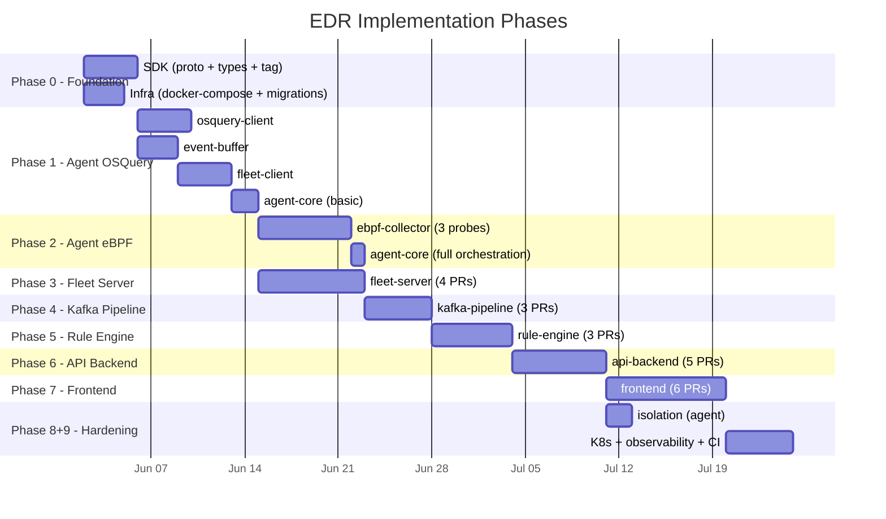
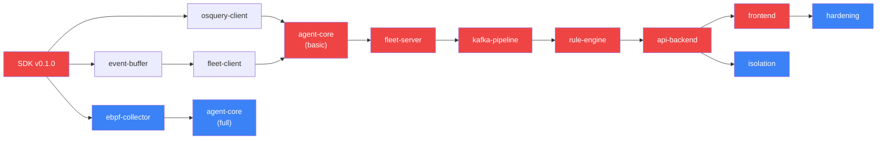

# EDR System — Master Implementation Timeline

> **Total Estimated Duration**: 10–12 weeks (single developer) / 5–6 weeks (2–3 developers)
> **Start Prerequisite**: Rust 1.85+, Docker, Node 20+

---

## Phase Overview

---

## Phase 0 — Foundation (Week 1)

**Goal**: SDK tagged, infra running, all repos scaffolded.

| Module | PRs | Duration | Timeline |
|---|---|---|---|
| [SDK](sdk/timeline.md) | 4 PRs | 3–4 days | Proto codegen → shared types → auth → v0.1.0 tag |
| [Infra](infra/timeline.md) | 2 PRs | 2–3 days | docker-compose + DB migrations |

**Milestone**: `docker-compose up` works, `sdk v0.1.0` tagged, all downstream crates resolve.

---

## Phase 1 — Agent: OSQuery Integration (Week 2)

**Goal**: Agent reads from OSQuery, buffers events locally, streams to Fleet Server stub.

| Module | PRs | Duration | Timeline |
|---|---|---|---|
| [osquery-client](agent/crates/osquery-client/timeline.md) | 2 PRs | 3–4 days | Socket client → scheduled queries |
| [event-buffer](agent/crates/event-buffer/timeline.md) | 2 PRs | 2–3 days | Sled storage → backpressure |
| [fleet-client](agent/crates/fleet-client/timeline.md) | 2 PRs | 3–4 days | gRPC enrollment → bidirectional stream |
| [agent-core](agent/crates/agent-core/timeline.md) | PR #1 | 1.5 days | Config + basic orchestrator |

**Milestone**: Agent enrolls with mock server, OSQuery events buffered and streamed.

---

## Phase 2 — Agent: eBPF Probes (Week 3–4)

**Goal**: Kernel-level telemetry flowing into the event pipeline.

| Module | PRs | Duration | Timeline |
|---|---|---|---|
| [ebpf-collector](agent/crates/ebpf-collector/timeline.md) | 3 PRs | 5–7 days | Process probe → file/network probes → aggregation |
| [agent-core](agent/crates/agent-core/timeline.md) | PR #2 | 1 day | Full orchestration with eBPF |

**Milestone**: All 3 eBPF probes attached, events flowing through buffer to fleet-client.

---

## Phase 3 — Fleet Server (Week 4–5)

**Goal**: Central hub accepts agent connections, produces events to Kafka.

| Module | PRs | Duration | Timeline |
|---|---|---|---|
| [fleet-server](fleet-server/timeline.md) | 4 PRs | 6–8 days | Skeleton → DB layer → enrollment → streaming + Kafka |

**Milestone**: Agent enrolls, streams events, fleet server produces to `edr.events.raw`.

---

## Phase 4 — Kafka Pipeline (Week 5–6)

**Goal**: Raw events normalised and persisted to PostgreSQL.

| Module | PRs | Duration | Timeline |
|---|---|---|---|
| [kafka-pipeline](kafka-pipeline/timeline.md) | 3 PRs | 4–5 days | Consumer → normaliser → DB writer + re-producer |

**Milestone**: Events flow from Kafka to PostgreSQL, normalised events on `edr.events.norm`.

---

## Phase 5 — Rule Engine (Week 6–7)

**Goal**: Alerts generated from suspicious events.

| Module | PRs | Duration | Timeline |
|---|---|---|---|
| [rule-engine](rule-engine/timeline.md) | 3 PRs | 5–6 days | Consumer → YARA scanning → MITRE mapping + alerts |

**Milestone**: Suspicious events trigger alerts on `edr.alerts` topic and in `edr_alerts` DB.

---

## Phase 6 — API Backend (Week 7–8)

**Goal**: REST API and WebSocket serving the frontend.

| Module | PRs | Duration | Timeline |
|---|---|---|---|
| [api-backend](api-backend/timeline.md) | 5 PRs | 6–7 days | Skeleton → auth → nodes/logs → alerts/commands → WebSocket |

**Milestone**: All REST endpoints functional, WebSocket broadcasting alerts in real-time.

---

## Phase 7 — Frontend Dashboard (Week 8–9)

**Goal**: Operator can view nodes, logs, and alerts in a browser.

| Module | PRs | Duration | Timeline |
|---|---|---|---|
| [frontend](frontend/timeline.md) | 6 PRs | 7–9 days | Init → auth → node map → alerts → live logs → dashboard |

**Milestone**: Full dashboard with real-time data, node controls, and alert management.

---

## Phase 8 — Node Isolation E2E (Week 9)

**Goal**: Operator isolates a node from dashboard, agent applies iptables rules.

| Module | PRs | Duration | Timeline |
|---|---|---|---|
| [isolation](agent/crates/isolation/timeline.md) | 2 PRs | 2 days | IPTables rules → status reporting |
| [agent-core](agent/crates/agent-core/timeline.md) | PR #3 | 0.5 day | Isolation command handling |

**Milestone**: Dashboard → API → Fleet Server → Agent → iptables → status reflected back.

---

## Phase 9 — Hardening & Observability (Week 10+)

**Goal**: Production-ready CI/CD, monitoring, security scanning.

| Module | PRs | Duration | Timeline |
|---|---|---|---|
| [Infra](infra/timeline.md) | 3 PRs | 3–5 days | K8s manifests → observability → runbooks |

**Milestone**: Full CI/CD pipeline, Prometheus + Grafana, Trivy scanning, structured logging.

---

## Total PR Count by Module

| Module | Total PRs |
|---|---|
| [SDK](sdk/timeline.md) | 4 |
| [Agent workspace](agent/timeline.md) | 2 |
| [osquery-client](agent/crates/osquery-client/timeline.md) | 2 |
| [event-buffer](agent/crates/event-buffer/timeline.md) | 2 |
| [fleet-client](agent/crates/fleet-client/timeline.md) | 2 |
| [ebpf-collector](agent/crates/ebpf-collector/timeline.md) | 3 |
| [isolation](agent/crates/isolation/timeline.md) | 2 |
| [agent-core](agent/crates/agent-core/timeline.md) | 3 |
| [fleet-server](fleet-server/timeline.md) | 4 |
| [kafka-pipeline](kafka-pipeline/timeline.md) | 3 |
| [rule-engine](rule-engine/timeline.md) | 3 |
| [api-backend](api-backend/timeline.md) | 5 |
| [frontend](frontend/timeline.md) | 6 |
| [infra](infra/timeline.md) | 5 |
| **Total** | **46 PRs** |

---

## Critical Path

🔴 **Red** = critical path — any delay here delays the entire project.
🔵 **Blue** = parallelisable — can be developed independently.

---

## Related Documents

- [Test Plan](tests/TEST_PLAN.md) — comprehensive testing strategy for every module
- [CI Caching Strategy](.github/CI_CACHING_STRATEGY.md) — build caching for fast CI
- [PR Template](.github/PULL_REQUEST_TEMPLATE.md) — standardised PR format with module checkboxes
- [Implementation Guide](EDR_IMPLEMENTATION_GUIDE.md) — full architecture and design reference
