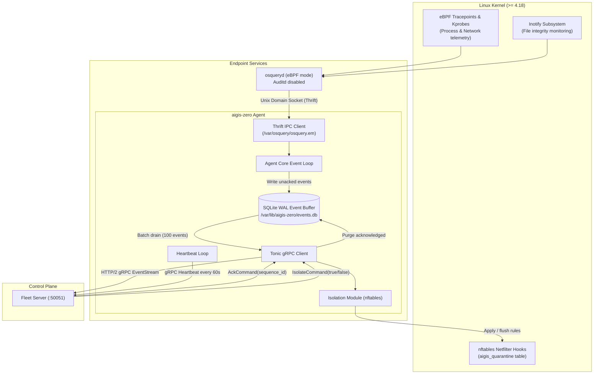

# Agent deployment and operations guide

This guide provides the complete operational reference for deploying, enrolling, and maintaining the Aigis-Zero Linux endpoint agent (`edr-agent`). It covers kernel prerequisites, osquery Thrift IPC, local SQLite WAL event buffering, the Fleet Server gRPC enrollment handshake, and kernel-level network containment using `nftables`.

## 1. System architecture

The endpoint agent runs as a native Linux daemon (`aigis-zero.service`) paired with `osqueryd`.



### Key architectural decisions

1. Two-process isolation: The agent daemon and `osqueryd` execute as separate processes. They communicate strictly over the extension manager Unix socket `/var/osquery/osquery.em`. If `osqueryd` crashes, the agent retains buffered records. If the agent restarts, `osqueryd` continues event collection.
2. Crash-resilient SQLite WAL buffering: Telemetry records are written to a local SQLite write-ahead log (`events.db`) prior to network transmission. If network connectivity drops, events accumulate on disk without memory bloat or data loss up to the configured ring buffer limit.
3. Strict netfilter isolation: Host quarantine applies `nftables` packet filtering directly in the kernel, severing lateral movement while leaving the control plane gRPC socket open.

## 2. Kernel prerequisites and system preparation

### Kernel requirements

| Requirement | Minimum | Recommended | Notes |
|---|---|---|---|
| Kernel version | 4.18 | 5.10+ | Requires `CONFIG_BPF_SYSCALL=y` |
| Architecture | x86_64 or aarch64 | x86_64 or aarch64 | Static musl binaries available for both |
| Memory | 256 MB | 512 MB | Typical RSS usage is under 50 MB |
| Local disk | 100 MB | 1 GB | Depends on SQLite buffer retention limit |

Verify eBPF support in the running kernel:
```bash
grep -E "CONFIG_BPF=y|CONFIG_BPF_SYSCALL=y" /boot/config-$(uname -r) 2>/dev/null || \
  zcat /proc/config.gz 2>/dev/null | grep -E "CONFIG_BPF=y|CONFIG_BPF_SYSCALL=y"
```

### Masking auditd

Aigis-Zero runs osquery in eBPF mode. The Linux audit netlink socket allows only one consumer. If `auditd` runs on the host, osquery cannot bind to the socket:

```bash
sudo systemctl stop auditd 2>/dev/null || true
sudo systemctl disable auditd 2>/dev/null || true
sudo systemctl mask auditd 2>/dev/null || true
sudo systemctl mask --now systemd-journald-audit.socket 2>/dev/null || true
```

## 3. Configuration file reference

The agent loads its settings from `/etc/aigis-zero/config.toml`:

```toml
[agent]
log_level = "info"                      # trace | debug | info | warn | error
log_format = "json"                     # json | human
log_dir = "/var/log/aigis-zero"
data_dir = "/var/lib/aigis-zero"
event_buffer_db = "/var/lib/aigis-zero/events.db"
event_buffer_max = 500000               # max unacked records before dropping oldest
event_drain_batch = 100                 # records per gRPC streaming frame
event_drain_interval_secs = 5

[osquery]
socket_path = "/var/osquery/osquery.em"
conf_path = "/etc/osquery/osquery.conf"
flags_path = "/etc/osquery/osquery.flags"
connect_timeout_secs = 30
query_timeout_secs = 60

[fleet]
host = "127.0.0.1"                     # Fleet Server IP or domain
port = 50051                           # Fleet Server gRPC port
enrollment_secret = "aigis_node_enrollment_pre_shared_key_change_me"
heartbeat_interval_secs = 60
reconnect_interval_secs = 10
max_reconnect_attempts = 0             # 0 = retry indefinitely with backoff

[isolation]
enabled = false                        # Managed automatically by fleet commands
allowed_ips = ["127.0.0.1"]            # Always allow fleet server IP during quarantine
```

## 4. End-to-end agent operational lifecycle

### Phase 1: Boot and preflight checks

When `aigis-zero.service` starts:
1. Validates that directories `/etc/aigis-zero`, `/var/lib/aigis-zero`, and `/var/log/aigis-zero` exist with permissions `0700` owned by root.
2. Initializes or opens `/var/lib/aigis-zero/events.db` in SQLite WAL mode (`PRAGMA journal_mode = WAL`).
3. Connects to the osquery extension socket `/var/osquery/osquery.em`.

### Phase 2: Fleet enrollment handshake

1. The agent gathers host hardware attributes:
   - `hostname`: Machine network hostname.
   - `os_version`: Operating system release string from `/etc/os-release`.
   - `agent_version`: Compiled agent binary version string.
   - `machine_id`: Unique stable hardware identifier from `/etc/machine-id`.
2. The agent sends a `RegisterRequest` to the Fleet Server over gRPC, passing `x-enrollment-secret` in metadata.
3. The Fleet Server validates the pre-shared secret and returns a `RegisterResponse` containing:
   - `node_id`: Permanent UUID assigned to this host.
   - `token`: 24-hour HMAC-SHA256 JWT.
4. The agent stores the JWT in memory for authenticating subsequent streaming requests.

### Phase 3: Telemetry ingestion and buffering

1. `osqueryd` evaluates scheduled queries defined in `scheduled_queries.toml` against kernel eBPF hooks (process starts, socket connects) and inotify (file modifications).
2. The agent Thrift client pulls query result diffs across the Unix domain socket.
3. The agent inserts records into SQLite `events.db` with an auto-incrementing `sequence_id` and timestamp.

### Phase 4: gRPC streaming and acknowledgment

1. The agent opens a persistent HTTP/2 `EventStream` to the Fleet Server, sending `Authorization: Bearer <JWT>` in headers.
2. The `event_drain` task queries up to 100 unacknowledged records from SQLite and pushes them over the stream.
3. When the Fleet Server writes records to Kafka, it returns a `ServerCommand::Ack(sequence_id)`.
4. The agent deletes acknowledged records up to that `sequence_id` from SQLite, keeping disk usage minimal.

### Phase 5: Network quarantine execution

When a security analyst isolates the host from the console:
1. The Fleet Server pushes `ServerCommand::Isolate { isolate: true, reason: "..." }` down the stream.
2. The agent calls its internal `isolation` module, which configures `nftables`:
   - Creates table `inet aigis_quarantine`.
   - Sets default policy for `input` and `output` chains to `drop`.
   - Permits loopback interface traffic (`iifname "lo" accept`, `oifname "lo" accept`).
   - Permits established and related TCP connections (`ct state established,related accept`).
   - Permits outbound traffic to the Fleet Server IP on port 50051 so control signals and telemetry continue functioning.
   - Drops all other incoming and outgoing packets.
3. When the analyst triggers un-isolation, `ServerCommand::Isolate { isolate: false }` arrives, and the agent flushes and removes the `aigis_quarantine` table.

## 5. Deployment methods

### Method A: Pre-built static musl tarball

Recommended for production. Zero runtime C library dependencies:

```bash
VERSION=agent-v0.1.0
ARCH=$(uname -m)

curl -fsSL \
  "https://github.com/swar09/aigis-zero/releases/download/${VERSION}/aigis-zero-agent-linux-${ARCH}.tar.gz" \
  -o aigis-zero-agent.tar.gz

tar -xzf aigis-zero-agent.tar.gz
cd aigis-zero-agent
sudo bash install.sh
```

### Method B: Build from source

```bash
# Install dependencies (Ubuntu / Debian)
sudo apt-get update && sudo apt-get install -y \
  build-essential pkg-config libssl-dev musl-tools

# Build release static binary
rustup target add x86_64-unknown-linux-musl
cargo build --release --target x86_64-unknown-linux-musl --bin edr-agent

# Install binary
sudo install -o root -g root -m 0755 \
  target/x86_64-unknown-linux-musl/release/edr-agent /usr/sbin/aigis-zero

# Create directories and configuration
sudo mkdir -p /etc/aigis-zero /var/lib/aigis-zero /var/log/aigis-zero
sudo chmod 700 /etc/aigis-zero /var/lib/aigis-zero
sudo cp agent/agent.toml /etc/aigis-zero/config.toml
sudo chmod 640 /etc/aigis-zero/config.toml

# Install and start systemd unit
sudo cp agent/systemd/aigis-zero.service /etc/systemd/system/
sudo systemctl daemon-reload
sudo systemctl enable --now aigis-zero
```

## 6. Service management and verification

```bash
# Check service status
systemctl status aigis-zero
systemctl status osqueryd

# View live structured logs
journalctl -u aigis-zero -f

# Verify local event buffer is draining
sqlite3 /var/lib/aigis-zero/events.db "SELECT count(*) FROM unacked_events;"

# Check active nftables quarantine rules
sudo nft list table inet aigis_quarantine 2>/dev/null || echo "Host is not quarantined"
```

## 7. Troubleshooting runbook

| Symptom | Probable Cause | Action |
|---|---|---|
| `enrollment rejected: invalid secret` | `enrollment_secret` in `config.toml` does not match server | Ensure `[fleet].enrollment_secret` matches `FLEET_ENROLLMENT_SECRET` in `.env` |
| `connection refused /var/osquery/osquery.em` | `osqueryd` is starting or failed to create socket | Run `systemctl status osqueryd` and verify socket directory permissions (`chmod 750 /var/osquery`) |
| `perf_event_open failed` in osquery log | Kernel lacks eBPF support | Verify kernel >= 4.18 and `CONFIG_BPF_SYSCALL=y` |
| Events buffering and not draining | Fleet server unreachable or token expired | Check network path to fleet server (`nc -zv <HOST> 50051`) and examine `journalctl -u aigis-zero` for gRPC status codes |
| Network isolation blocks fleet traffic | Fleet server IP was not added to allowed list | Check `allowed_ips` in `[isolation]` table in `/etc/aigis-zero/config.toml` |
