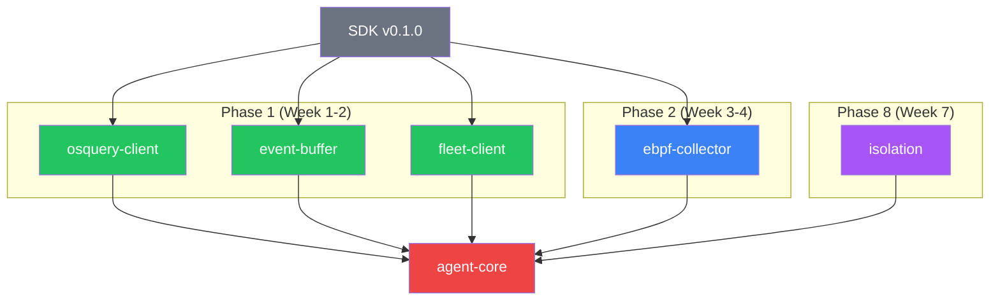

# Agent Workspace — Implementation Timeline

> **Phases**: 1 (OSQuery) → 2 (eBPF) → 8 (Isolation)
> **Priority**: 🔴 Critical path — agent is the data source for everything
> **Estimated Duration**: 4–5 weeks total across phases
> **Depends on**: `sdk v0.1.0` tagged

---

## Overview

The agent is a Cargo workspace with 6 member crates. Implementation follows a bottom-up dependency order: shared utilities first, then collectors, then the orchestrator.

## Implementation Order

## Cross-Crate PRs

### PR #1 — Workspace config and CI verification
**Branch**: `chore/workspace-setup`
**Duration**: 0.5 day

**Tasks**:
- [ ] Verify all 6 crate `Cargo.toml` files resolve correctly
- [ ] Ensure `cargo check --workspace` passes (with stub lib.rs files)
- [ ] Verify `.cargo/config.toml` linker settings
- [ ] Add workspace-level `rustfmt.toml` and `clippy.toml`

### PR #2 — Integration test harness
**Branch**: `feat/integration-tests`
**Duration**: 1 day
**Depends on**: All Phase 1 crates implemented

**Tasks**:
- [ ] Create `tests/` directory at workspace root
- [ ] Write integration test: osquery-client → event-buffer → fleet-client pipeline
- [ ] Mock Fleet Server gRPC endpoint for testing
- [ ] Verify events flow end-to-end locally

---

See individual crate `timeline.md` files for per-crate PR plans.
