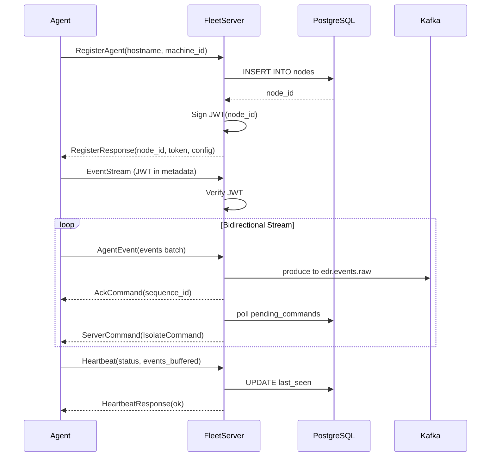

# Fleet Server — Implementation Timeline

> **Phase**: 3 (Enrollment & Streaming)
> **Priority**: 🔴 Critical — central hub for all agents
> **Estimated Duration**: 6–8 days
> **Depends on**: `sdk v0.1.0`, infra docker-compose running

---

## Enrollment & Streaming Flow

## PR Dependency Chain

## PR Plan

### PR #1 — Project skeleton, config, and AppState
**Branch**: `feat/fleet-skeleton`
**Duration**: 1 day

**Files**:
- `src/main.rs` — tokio runtime, binds gRPC + HTTP servers
- `src/config.rs` — env vars + config file loading
- `src/state.rs` — `AppState` with DB pool, Kafka producer, shared config
- `src/error.rs` — unified error types with thiserror

**Tasks**:
- [ ] Load config from env vars (`DATABASE_URL`, `KAFKA_BROKERS`, `GRPC_BIND_ADDR`, etc.)
- [ ] Initialize sqlx PostgreSQL connection pool
- [ ] Initialize rdkafka producer
- [ ] Build `Arc<AppState>` with all shared resources
- [ ] Start HTTP health check endpoint on admin port
- [ ] Structured logging with tracing-subscriber

### PR #2 — Database layer and migrations
**Branch**: `feat/fleet-db`
**Duration**: 1.5 days
**Depends on**: PR #1

**Files**:
- `src/db/mod.rs`, `src/db/nodes.rs`, `src/db/health.rs`, `src/db/config.rs`
- `migrations/001_create_nodes.sql` ← already exists

**Tasks**:
- [ ] Run sqlx migrations on startup
- [ ] Implement `db::nodes::insert_node()`, `get_node()`, `list_nodes()`, `update_status()`
- [ ] Implement `db::health::update_heartbeat()`, `get_last_seen()`
- [ ] Implement `db::config::get_config()`, `update_config()`
- [ ] Implement `db::nodes::insert_pending_command()`, `get_pending_commands()`
- [ ] Unit tests with sqlx test fixtures

### PR #3 — gRPC enrollment (RegisterAgent)
**Branch**: `feat/fleet-enrollment`
**Duration**: 1.5 days
**Depends on**: PR #2

**Files**:
- `src/grpc/mod.rs`, `src/grpc/server.rs`, `src/grpc/enrollment.rs`

**Tasks**:
- [ ] Implement `FleetService` tonic trait
- [ ] Implement `RegisterAgent` RPC — validate request, insert node, sign JWT, return config
- [ ] JWT signing with `jsonwebtoken` (HS256, configurable secret)
- [ ] Reject duplicate enrollments (check `machine_id` uniqueness)
- [ ] Integration test: agent enrollment flow

### PR #4 — Bidirectional EventStream and Kafka producer
**Branch**: `feat/fleet-streaming`
**Duration**: 2 days
**Depends on**: PR #3

**Files**:
- `src/grpc/stream.rs`, `src/grpc/commands.rs`
- `src/kafka/mod.rs`, `src/kafka/producer.rs`

**Tasks**:
- [ ] Implement `EventStream` RPC — bidirectional tonic stream
- [ ] Authenticate stream via JWT metadata header
- [ ] Receive `AgentEvent` messages → produce to Kafka `edr.events.raw`
- [ ] Send `ServerCommand` messages (Ack, ConfigUpdate, Isolate)
- [ ] Poll `pending_commands` table and relay to connected agent
- [ ] Implement Kafka producer with delivery guarantees
- [ ] Handle stream disconnection, mark node as offline
- [ ] Integration test: mock agent ↔ fleet server stream
