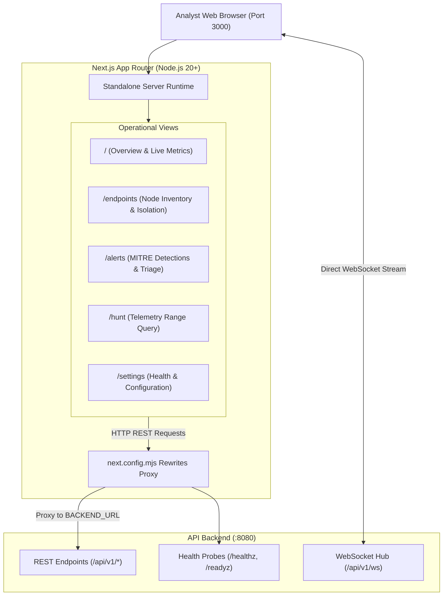

# Frontend Console deployment and operations guide

This guide covers the architecture, operator workflows, backend reverse proxy configuration, and production deployment runbooks for the Aigis-Zero SOC Console (`frontend`).

## 1. System architecture

The frontend console is built with Next.js 15 App Router and TypeScript. It communicates with the backend via REST proxies and establishes direct WebSocket connections for real-time telemetry streaming.



### Operational views

1. System Overview (`/`): Real-time fleet health metrics, active alert count by severity (critical, high, medium, low), and live telemetry throughput graphs.
2. Endpoints Directory (`/endpoints`): Inventory of all enrolled agents, hardware machine IDs, IP addresses, OS kernel versions, and operator containment status. Analysts can execute instant network quarantine or restore network connectivity.
3. Detections and Alerts (`/alerts`): Real-time threat detection feed evaluated by YARA-X rules, enriched with MITRE ATT&CK tactics, techniques, and threat scoring. Supports status transitions (`open`, `acknowledged`, `dismissed`).
4. Threat Hunting (`/hunt`): Structured historical telemetry search across process executions, socket connections, file modifications, and authentication logs with collapsible JSON payload trees.
5. System Settings (`/settings`): Diagnostic health status of downstream services, database pool status, agent bootstrap script generator, and operator session tokens.

## 2. Backend connectivity and reverse proxy

Next.js proxies requests to avoid CORS configuration issues during development and deployment. The proxy is defined in `next.config.mjs`:

```javascript
/** @type {import('next').NextConfig} */
const nextConfig = {
  output: 'standalone',
  reactStrictMode: true,
  async rewrites() {
    const backendUrl = process.env.BACKEND_URL || 'http://api-backend:8080';
    return [
      {
        source: '/api/v1/:path*',
        destination: `${backendUrl}/api/v1/:path*`,
      },
      {
        source: '/healthz',
        destination: `${backendUrl}/healthz`,
      },
      {
        source: '/readyz',
        destination: `${backendUrl}/readyz`,
      },
    ];
  },
};
```

### Destination configuration

- When running inside Docker Compose: `BACKEND_URL` defaults to `http://api-backend:8080`.
- When running locally against host services: Set `BACKEND_URL=http://localhost:8080`.

## 3. Local development runbook

### Prerequisites
- Node.js 20 LTS or higher
- npm 10+
- Running Aigis-Zero API backend on port 8080

### Installation and startup

```bash
cd frontend

# Install dependencies
npm install

# Start Next.js development server pointing to host API backend
BACKEND_URL=http://localhost:8080 npm run dev
```

Open [http://localhost:3000](http://localhost:3000) in your browser. Default operator credentials are `admin` / `admin`.

### Verification and code quality

```bash
# Run ESLint checks
npm run lint

# Run TypeScript type check
npm run typecheck

# Run unit tests
npm run test
```

## 4. Production build and deployment

The Next.js configuration is set to `output: 'standalone'`, which produces a compact self-contained Node.js server bundle inside `.next/standalone`.

### Manual production build

```bash
cd frontend
npm run build

# Start the standalone server
BACKEND_URL=http://localhost:8080 node .next/standalone/server.js
```

### Pulling and running pre-built Docker image

Pull the published image from GitHub Container Registry:

```bash
docker pull ghcr.io/swar09/aigis-frontend:latest
```

Run standalone container with backend proxy target:

```bash
docker run -d \
  --name edr-frontend \
  --restart unless-stopped \
  -p 3000:3000 \
  -e BACKEND_URL=http://localhost:8080 \
  ghcr.io/swar09/aigis-frontend:latest
```

### Docker container build from source

Example multi-stage Dockerfile for the frontend:

```dockerfile
FROM node:20-alpine AS builder
WORKDIR /app
COPY package*.json ./
RUN npm ci
COPY . .
ENV NEXT_TELEMETRY_DISABLED=1
RUN npm run build

FROM node:20-alpine AS runner
WORKDIR /app
ENV NODE_ENV=production
ENV PORT=3000
COPY --from=builder /app/public ./public
COPY --from=builder /app/.next/standalone ./
COPY --from=builder /app/.next/static ./.next/static
EXPOSE 3000
CMD ["node", "server.js"]
```

## 5. Security headers

The frontend sets strict security headers on all incoming routes via `next.config.mjs`:
- `X-Frame-Options: DENY` (prevents clickjacking)
- `X-Content-Type-Options: nosniff` (prevents MIME sniffing)
- `Referrer-Policy: strict-origin-when-cross-origin`
- `Permissions-Policy: camera=(), microphone=(), geolocation=()`

## 6. Operational troubleshooting

### 502 Bad Gateway on `/api/v1/*` requests
- Cause: The Next.js rewrite proxy cannot reach the API backend at `BACKEND_URL`.
- Fix: Ensure the API backend is listening on port 8080 (`curl http://localhost:8080/healthz`). Verify that `BACKEND_URL=http://localhost:8080` is exported in the shell running `npm run dev`.

### WebSocket connection fails to initialize
- Symptom: Dashboard displays `Live feed disconnected` or WebSocket errors in browser console.
- Cause: The browser attempted to connect to an unreachable WebSocket address or port.
- Fix: Check that the API backend is running and that port 8080 is accessible directly from the browser for WebSocket upgrade requests.

### Authentication token expiration
- Symptom: API requests return HTTP 401 Unauthorized after 24 hours.
- Cause: JWT tokens issued by `/api/v1/auth/login` expire after 86400 seconds.
- Fix: Log out and log back in from the console to refresh the session token.
