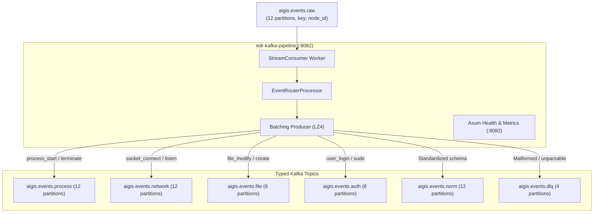

# Kafka Pipeline deployment and operations guide

This guide covers the architecture, topic routing logic, dead-letter queue (DLQ) error handling, and production deployment runbooks for the Aigis-Zero Kafka Pipeline (`edr-kafka-pipeline`).

## 1. System architecture and event routing

The Kafka Pipeline service normalizes raw endpoint telemetry and fans records out into typed topics for consumption by detection engines and storage services.



### Key features

1. Key-preserving fanout: Records retain their original `node_id` partition key, ensuring all events from a given host maintain strict chronological ordering across downstream topics.
2. Low-latency micro-batching: Uses LZ4 compression and 5ms producer queue buffering to maximize broker throughput while keeping processing latency minimal.
3. Dead-letter queue isolation: Unparsable JSON or schema errors route to `aigis.events.dlq` with diagnostic headers, preventing pipeline stalls.

## 2. Topic routing matrix

The `EventRouterProcessor` inspects the JSON payload of each raw event:

| Event Type / Pattern | Destination Topic | Primary Downstream Consumers |
|---|---|---|
| `process_start`, `process_terminate`, `exec` | `aigis.events.process` | Rule Engine (YARA-X process rules) |
| `socket_connect`, `bind`, `listen` | `aigis.events.network` | Rule Engine (C2 & port scan detection) |
| `file_modify`, `file_create`, `file_delete` | `aigis.events.file` | Rule Engine (Ransomware & persistence detection) |
| `user_login`, `sudo_exec`, `pam_auth` | `aigis.events.auth` | Rule Engine (Brute force & privilege escalation) |
| Normalized common telemetry | `aigis.events.norm` | Long-term PostgreSQL storage and data lakes |
| Unparsable JSON or unknown event formats | `aigis.events.dlq` | Operator DLQ triage and ingestion debuggers |

## 3. Configuration reference

Set environment variables in `.env` or systemd environment files:

```bash
# Kafka broker addresses (comma-separated)
# Use localhost:9092 when running on host, or kafka:29092 inside Docker
KAFKA_BROKERS=localhost:9092

# Consumer group identifier
KAFKA_CONSUMER_GROUP=aigis-kafka-pipeline

# Inbound and DLQ topics
KAFKA_SOURCE_TOPIC=aigis.events.raw
KAFKA_DLQ_TOPIC=aigis.events.dlq

# Health probe and Prometheus exporter port
HEALTH_PORT=8082

# Observability
RUST_LOG=info,edr_kafka_pipeline=debug
```

## 4. End-to-end routing verification

Verify the event router by manually producing a test event to `aigis.events.raw` and verifying it arrives in `aigis.events.process`:

1. Produce a test event:
   ```bash
   docker exec -i edr-kafka kafka-console-producer \
     --bootstrap-server localhost:9092 \
     --topic aigis.events.raw <<EOF
   {"node_id": "00000000-0000-0000-0000-000000000001", "event_type": "process_start", "process_name": "nc", "cmdline": "nc -lvp 4444"}
   EOF
   ```

2. Consume from the target topic:
   ```bash
   docker exec -i edr-kafka kafka-console-consumer \
     --bootstrap-server localhost:9092 \
     --topic aigis.events.process \
     --from-beginning \
     --max-messages 1
   ```

3. Confirm that the message payload is received on `aigis.events.process`.

## 5. Dead-letter queue error handling

When an incoming record cannot be deserialized, the pipeline routes it to `aigis.events.dlq` and attaches four Kafka headers:

- `x-error-reason`: Error message explaining why routing failed (e.g. invalid JSON, missing event_type).
- `x-source-topic`: Originating topic (`aigis.events.raw`).
- `x-original-partition`: Source partition index.
- `x-original-offset`: Source message offset.

Inspect dead-letter messages with Kafka UI at [http://localhost:8090](http://localhost:8090) or using `kafka-console-consumer` with header printing enabled.

## 6. Health probes and Prometheus metrics

The service exposes HTTP endpoints on port `8082`:

- `GET /healthz` or `GET /health/live`: Process liveness probe (returns HTTP 200 `OK`).
- `GET /readyz` or `GET /health/ready`: Readiness probe verifying active Kafka consumer and producer connections (returns HTTP 200 `READY`).
- `GET /metrics`: Exposes Prometheus metrics:
  - `aigis_pipeline_events_consumed_total`: Cumulative count of messages consumed.
  - `aigis_pipeline_events_routed_total{topic="..."}`: Count of routed messages per destination topic.
  - `aigis_pipeline_routing_errors_total`: Count of failed messages directed to DLQ.

Check readiness:
```bash
curl -s http://localhost:8082/readyz
```

## 7. Production deployment

### Docker Compose deployment

```bash
cd infra
docker compose up -d kafka-pipeline
```

### Pulling and running pre-built Docker image

Pull the published image from GitHub Container Registry:

```bash
docker pull ghcr.io/swar09/aigis-kafka-pipeline:latest
```

Run standalone container with environment file:

```bash
docker run -d \
  --name edr-kafka-pipeline \
  --restart unless-stopped \
  -p 8082:8082 \
  --env-file .env \
  ghcr.io/swar09/aigis-kafka-pipeline:latest
```

### Systemd deployment

Create `/etc/systemd/system/edr-kafka-pipeline.service`:

```ini
[Unit]
Description=Aigis-Zero Kafka Telemetry Pipeline
After=network.target

[Service]
Type=simple
User=edr
Group=edr
EnvironmentFile=/etc/aigis-zero/kafka-pipeline.env
ExecStart=/usr/local/bin/edr-kafka-pipeline
Restart=always
RestartSec=5
LimitNOFILE=65535

[Install]
WantedBy=multi-user.target
```

Enable and start:
```bash
sudo systemctl daemon-reload
sudo systemctl enable --now edr-kafka-pipeline
sudo systemctl status edr-kafka-pipeline
```

## 8. Operational troubleshooting

### CMake missing error during build
- Symptom: `rdkafka-sys` fails to compile with `No such file or directory` looking for `cmake`.
- Fix: Install build tools:
  - Ubuntu / Debian: `sudo apt-get install -y cmake g++`
  - RHEL / Fedora: `sudo dnf install -y cmake gcc-c++`

### Broker transport failure
- Symptom: Repeated log lines `BrokerTransportFailure: localhost:9092`.
- Fix: If running inside Docker, set `KAFKA_BROKERS=kafka:29092`. If running as a host process, set `KAFKA_BROKERS=localhost:9092`. Ensure Kafka container is running and healthy.
