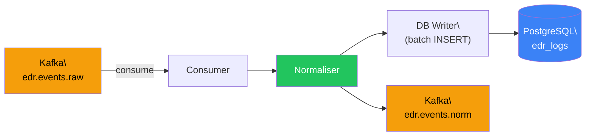

# Kafka Pipeline — Implementation Timeline

> **Phase**: 4 (Kafka Pipeline & Database)
> **Priority**: 🟡 High — bridges raw events to normalised storage
> **Estimated Duration**: 4–5 days
> **Depends on**: `sdk v0.1.0`, infra running, fleet-server producing to Kafka

---

## Pipeline Data Flow

## PR Plan

### PR #1 — Consumer, config, and skeleton
**Branch**: `feat/pipeline-skeleton`
**Duration**: 1 day

**Files**:
- `src/main.rs` — tokio runtime, spawns consumer + db_writer tasks
- `src/config.rs` — Kafka brokers, DB URL, consumer group
- `src/consumer.rs` — rdkafka consumer for `edr.events.raw`
- `src/error.rs` — error types

**Tasks**:
- [ ] Configure rdkafka `StreamConsumer` with consumer group `edr-pipeline`
- [ ] Subscribe to `edr.events.raw` topic
- [ ] Deserialise raw event bytes from Kafka messages
- [ ] Structured logging and graceful shutdown
- [ ] Integration test: produce mock message → consumer receives it

### PR #2 — Normaliser and event transformation
**Branch**: `feat/pipeline-normaliser`
**Duration**: 1.5 days
**Depends on**: PR #1

**Files**:
- `src/normalizer.rs` — raw event → `NormalisedEvent` transformation

**Tasks**:
- [ ] Parse `AgentEvent.payload` JSON bytes
- [ ] Route by `event_type` → construct appropriate `EventPayload` variant
- [ ] Enrich with UUID, timestamp normalisation, hostname lookup
- [ ] Handle malformed events gracefully (log + skip, don't crash)
- [ ] Unit tests for each event type transformation
- [ ] Fuzz test for malformed JSON handling

### PR #3 — DB writer and Kafka re-producer
**Branch**: `feat/pipeline-db-producer`
**Duration**: 1.5 days
**Depends on**: PR #2

**Files**:
- `src/db_writer.rs` — batch inserts to `edr_logs` PostgreSQL
- `src/producer.rs` — produces to `edr.events.norm`

**Tasks**:
- [ ] Batch insert normalised events to PostgreSQL (configurable batch size)
- [ ] Produce normalised events to `edr.events.norm` topic
- [ ] Implement exactly-once semantics (Kafka transactions or idempotent writes)
- [ ] Commit Kafka offsets only after DB write + re-produce succeed
- [ ] Handle DB connection failures with retry and circuit breaker
- [ ] Performance test: 10k events/sec throughput target
