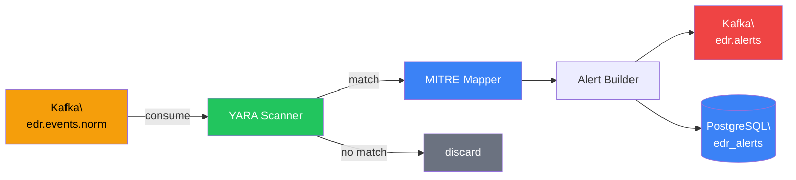

# Rule Engine — Implementation Timeline

> **Phase**: 5 (YARA + MITRE Detection)
> **Priority**: 🟡 High — generates alerts from normalised events
> **Estimated Duration**: 5–6 days
> **Depends on**: `sdk v0.1.0`, kafka-pipeline producing to `edr.events.norm`

---

## Detection Pipeline

## PR Plan

### PR #1 — Kafka consumer and skeleton
**Branch**: `feat/rules-skeleton`
**Duration**: 1 day

**Files**:
- `src/main.rs` — runtime, task spawning
- `src/config.rs` — Kafka, DB, rules directory config
- `src/consumer.rs` — rdkafka consumer for `edr.events.norm`

**Tasks**:
- [ ] Configure consumer group `edr-rules`
- [ ] Subscribe to `edr.events.norm`
- [ ] Deserialise `NormalisedEvent` from Kafka
- [ ] Pass events through detection pipeline

### PR #2 — YARA rule loading and scanning
**Branch**: `feat/rules-yara`
**Duration**: 2 days
**Depends on**: PR #1

**Files**:
- `src/rules/loader.rs` — loads `.yar` files from rules directory
- `src/yara_scanner.rs` — compiles and evaluates YARA rules
- `rules/process_injection.yar`, `rules/credential_access.yar`, `rules/persistence.yar`

**Tasks**:
- [ ] Load all `.yar` files from configurable directory (`/etc/edr/rules/`)
- [ ] Compile rules into `yara_x::Rules` at startup
- [ ] Scan event payloads against compiled rules
- [ ] Support hot-reload of rules (watch directory for changes)
- [ ] Write default YARA rules for common attack patterns
- [ ] Unit tests: known-bad event → rule match, benign event → no match

### PR #3 — MITRE ATT&CK mapping and alert generation
**Branch**: `feat/rules-mitre-alerts`
**Duration**: 1.5 days
**Depends on**: PR #2

**Files**:
- `src/mitre_mapper.rs` — technique ID → tactic lookup
- `src/alert_producer.rs` — Kafka producer to `edr.alerts`
- `src/db_writer.rs` — writes alerts to `edr_alerts` DB

**Tasks**:
- [ ] Build MITRE ATT&CK lookup table (technique ID → tactic, name, description)
- [ ] Map YARA rule matches to MITRE technique IDs via rule metadata
- [ ] Construct `Alert` struct with severity, MITRE context, threat score
- [ ] Produce alerts to `edr.alerts` Kafka topic
- [ ] Write alerts to `edr_alerts` PostgreSQL
- [ ] Deduplicate alerts (same event + same rule = one alert)
- [ ] Unit tests for mapping and alert construction
