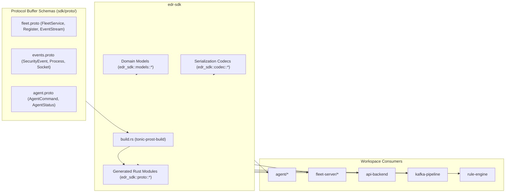

# SDK developer and integration guide

This guide covers the shared domain contracts, Protocol Buffer specifications, code generation pipelines, and serialization codecs provided by the `edr-sdk` crate.

## 1. System role and boundaries

The `edr-sdk` crate defines the contract layer for all Aigis-Zero subsystems. It maintains zero business logic and serves strictly as:

1. Canonical Protocol Buffer definitions for network transports (gRPC, Kafka).
2. Type-safe generated Rust structs using `prost` and `tonic`.
3. Common serialization and deserialization codecs (JSON, raw byte streams).
4. Shared domain models for node enrollment, telemetry envelopes, and health heartbeats.



## 2. Protocol Buffer contracts

### fleet.proto (`edr.fleet`)

Defines the gRPC control plane interface between endpoints and the Fleet Server:

```protobuf
service FleetService {
  rpc RegisterAgent(RegisterRequest) returns (RegisterResponse);
  rpc EventStream(stream AgentEvent) returns (stream ServerCommand);
  rpc Heartbeat(HeartbeatRequest) returns (HeartbeatResponse);
}
```

Key message definitions:
- `RegisterRequest`: Sent by agent during initial enrollment (`hostname`, `os_version`, `agent_version`, `machine_id`).
- `RegisterResponse`: Returns assigned `node_id`, 24-hour authentication `token`, and optional `config`.
- `AgentEvent`: Ingest payload streaming telemetry (`node_id`, `event_type`, `payload`, `timestamp_ns`, `sequence_id`).
- `ServerCommand`: Oneof container for server-to-agent commands:
  - `IsolateCommand`: Instructs agent to apply or lift `nftables` isolation (`isolate: bool`, `reason: string`).
  - `ConfigUpdateCommand`: Delivers updated scheduled queries or intervals.
  - `AckCommand`: Acknowledges ingested sequence IDs for local buffer eviction.
- `HeartbeatRequest`: Periodic liveness signal (`node_id`, `status`, `events_buffered`).

### events.proto (`edr.events`)

Defines typed telemetry records:
- `ProcessEvent`: Process creation and termination (`pid`, `ppid`, `path`, `cmdline`, `uid`, `euid`).
- `NetworkEvent`: Socket activity (`source_address`, `destination_address`, `source_port`, `destination_port`, `protocol`).
- `FileEvent`: File integrity monitoring (`action`, `target_path`, `sha256`).
- `AuthEvent`: Authentication and privilege escalation (`user`, `terminal`, `success`, `failure_reason`).

## 3. Code generation with build.rs

Protocol Buffers compile automatically during `cargo build` using `build.rs`:

```rust
fn main() -> Result<(), Box<dyn std::error::Error>> {
    tonic_prost_build::compile_protos(&[
        "proto/fleet.proto",
        "proto/events.proto",
        "proto/agent.proto",
    ])?;
    Ok(())
}
```

Generated code is exported in `src/lib.rs` under the `proto` module:

```rust
pub mod proto {
    pub mod agent {
        tonic::include_proto!("edr.agent");
    }
    pub mod events {
        tonic::include_proto!("edr.events");
    }
    pub mod fleet {
        tonic::include_proto!("edr.fleet");
    }
}
```

## 4. Domain models and codecs

The SDK provides helper models and codecs for standardizing payloads across database and message broker boundaries:

- `models::enrollment`: Represents node registration states and pre-shared key validation tokens.
- `models::envelope`: Encapsulates telemetry payloads with envelope metadata (timestamps, node IDs, routing keys).
- `models::heartbeat`: Liveness tracking records for registry updates.
- `codec`: Fast JSON and binary serialization helpers with error handling.

## 5. Adding new Protocol Buffer fields or RPCs

When modifying or extending contracts:

1. Edit the relevant `.proto` file in `sdk/proto/`.
2. Ensure backward compatibility:
   - Never change existing tag numbers.
   - Only add optional or repeated fields.
   - If renaming a message or field, deprecate the old field rather than removing it immediately.
3. Run code generation and verify all workspace crates compile:
   ```bash
   cargo build -p edr-sdk
   cargo test -p edr-sdk
   ```
4. Verify downstream crates:
   ```bash
   cargo check --workspace
   ```
