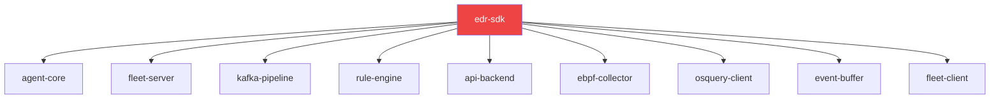

# SDK — Implementation Timeline

> **Phase**: 0 (Foundation)
> **Priority**: 🔴 Critical — every other service depends on this
> **Estimated Duration**: 3–4 days

---

## Overview

The SDK is the compile-time contract between all services. It must be implemented **first** and tagged `v0.1.0` before any other service can begin. Every type change here triggers a version bump and cascading PRs.

---

## PR Plan

### PR #1 — Proto definitions and tonic code generation
**Branch**: `feat/proto-codegen`
**Duration**: 1 day
**Files**:
- `proto/fleet.proto` ← already scaffolded
- `proto/agent.proto` ← already scaffolded
- `proto/events.proto` ← already scaffolded
- `build.rs` ← compile protos via tonic-build
- `src/proto/mod.rs` ← re-export generated code

**Tasks**:
- [ ] Finalise proto message definitions (review field types, naming)
- [ ] Write `build.rs` that invokes `tonic_build::configure()` for all 3 protos
- [ ] Create `src/proto/mod.rs` that re-exports generated Rust modules
- [ ] Verify `cargo build` compiles cleanly with generated code
- [ ] Add doc comments to proto files explaining each message

**Acceptance Criteria**:
- `cargo build` succeeds
- Generated Rust code is accessible via `edr_sdk::proto::*`

---

### PR #2 — Core shared types (events, alerts, nodes)
**Branch**: `feat/shared-types`
**Duration**: 1 day
**Depends on**: PR #1

**Files**:
- `src/lib.rs` ← module declarations
- `src/types/mod.rs` ← re-exports
- `src/types/event.rs` ← `NormalisedEvent`, `EventPayload`, `ProcessEvent`, `FileEvent`, `NetworkEvent`
- `src/types/alert.rs` ← `Alert`, `Severity`, `AlertSource`, `AlertStatus`
- `src/types/node.rs` ← `Node`, `NodeStatus`, `NodeConfig`

**Tasks**:
- [ ] Define `NormalisedEvent` struct with serde derive
- [ ] Define `EventPayload` enum (Process, File, Network, OsqueryResult)
- [ ] Define `ProcessEvent`, `FileEvent`, `NetworkEvent`, `OsqueryEvent` structs
- [ ] Define `Alert` struct with all MITRE fields
- [ ] Define enums: `Severity`, `AlertSource`, `AlertStatus`, `FileOperation`, `NetworkDirection`, `EventType`
- [ ] Define `Node`, `NodeStatus` types
- [ ] Add `#[cfg(test)]` unit tests for serialization roundtrips
- [ ] Ensure all types implement `Debug, Clone, Serialize, Deserialize`

**Acceptance Criteria**:
- All types compile and serialize/deserialize correctly
- `cargo test` passes

---

### PR #3 — Auth types and client helpers
**Branch**: `feat/auth-helpers`
**Duration**: 0.5 day
**Depends on**: PR #2

**Files**:
- `src/types/auth.rs` ← `Claims` (JWT payload struct)
- `src/auth/mod.rs` ← JWT validation helpers (optional, thin wrappers)

**Tasks**:
- [ ] Define `Claims` struct matching JWT payload (node_id, exp, iat, role)
- [ ] Add helper functions for token validation if shared across services
- [ ] Unit tests for Claims serialization

---

### PR #4 — Version tag and release
**Branch**: `main` (direct tag after merge)
**Duration**: 0.5 day
**Depends on**: PR #1–3 merged

**Tasks**:
- [ ] Verify full `cargo test --all` passes
- [ ] Run `cargo clippy -- -D warnings`
- [ ] Run `cargo fmt --check`
- [ ] Tag `v0.1.0`
- [ ] Update consuming services' `Cargo.toml` to point to this tag
- [ ] Document public API in `README.md`

**Acceptance Criteria**:
- Tag `v0.1.0` exists
- All downstream services can `cargo build` with this dependency

---

## Ongoing Maintenance

| Trigger | Action | Version Bump |
|---|---|---|
| Add optional field to existing struct | Patch (0.1.1) |
| Add new message type / RPC | Minor (0.2.0) |
| Change existing field type or remove field | Major (1.0.0) |

Every version bump triggers PRs in all consuming services to update the dependency.
