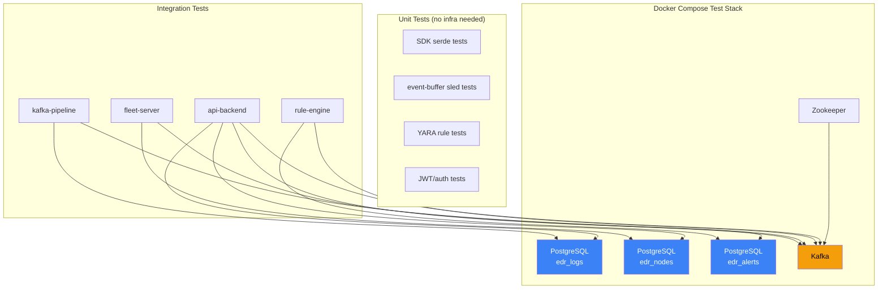
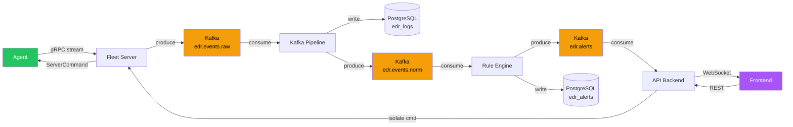

# EDR System — Comprehensive Test Plan

> This document defines the testing strategy for every module and crate in the EDR system.
> Tests are categorised into: **Unit**, **Integration**, **End-to-End (E2E)**, and **Performance**.

---

## Table of Contents

1. [Testing Philosophy](#testing-philosophy)
2. [SDK Tests](#1-sdk)
3. [Agent Tests](#2-agent-workspace)
   - [osquery-client](#21-osquery-client)
   - [event-buffer](#22-event-buffer)
   - [fleet-client](#23-fleet-client)
   - [ebpf-collector](#24-ebpf-collector)
   - [isolation](#25-isolation)
   - [agent-core](#26-agent-core)
4. [Fleet Server Tests](#3-fleet-server)
5. [Kafka Pipeline Tests](#4-kafka-pipeline)
6. [Rule Engine Tests](#5-rule-engine)
7. [API Backend Tests](#6-api-backend)
8. [Frontend Tests](#7-frontend)
9. [End-to-End Tests](#8-end-to-end)
10. [Performance Tests](#9-performance-benchmarks)

---

## Testing Philosophy

- **Unit tests** live next to source code (`#[cfg(test)]` modules in Rust, `*.test.ts` in frontend)
- **Integration tests** live in each crate/service's `tests/` directory
- **E2E tests** live in this top-level `tests/` directory
- **No mocks for databases** in integration tests — use real PostgreSQL via Docker
- **No mocks for Kafka** in integration tests — use real Kafka via Docker
- **CI runs all tests** via `cargo test --workspace` per service

### Test Infrastructure Requirements

| Resource | Used By | Provisioned Via |
|---|---|---|
| PostgreSQL (3 instances) | fleet-server, kafka-pipeline, rule-engine, api-backend | `docker-compose` |
| Kafka + Zookeeper | fleet-server, kafka-pipeline, rule-engine, api-backend | `docker-compose` |
| OSQuery socket (mock) | osquery-client | Unix socket mock in test |
| Linux kernel (eBPF) | ebpf-collector | Requires real Linux, CI uses `ubuntu-latest` |

### Test Infrastructure Diagram

---

## 1. SDK

### Unit Tests

| Test | What it verifies |
|---|---|
| `test_normalised_event_serde_roundtrip` | `NormalisedEvent` serialises to JSON and deserialises back identically |
| `test_event_payload_tagged_enum` | `EventPayload` serde `tag` attribute produces correct `"type"` field |
| `test_process_event_fields` | All `ProcessEvent` fields serialise with correct names |
| `test_file_event_fields` | `FileEvent` with each `FileOperation` variant |
| `test_network_event_fields` | `NetworkEvent` with `NetworkDirection` variants |
| `test_alert_serde` | `Alert` with all optional MITRE fields (Some + None) |
| `test_severity_ordering` | `Severity` variants compare correctly (Critical > High > Medium > Low) |
| `test_claims_jwt_payload` | `Claims` struct matches expected JWT JSON structure |
| `test_proto_codegen` | Generated proto Rust types compile and instantiate correctly |

### Build Tests

| Test | What it verifies |
|---|---|
| `test_build_rs_compiles_protos` | `build.rs` successfully generates code from all 3 `.proto` files |
| `test_proto_backward_compat` | Adding optional field doesn't break existing message parsing |

---

## 2. Agent Workspace

### 2.1 osquery-client

#### Unit Tests

| Test | What it verifies |
|---|---|
| `test_parse_osquery_json_response` | Raw OSQuery JSON → `Vec<HashMap<String, String>>` parsing |
| `test_convert_to_osquery_event` | OSQuery row → `OsqueryEvent` → `NormalisedEvent` conversion |
| `test_scheduled_query_interval` | Queries fire at configured intervals (use `tokio::time::pause`) |
| `test_malformed_json_handling` | Invalid JSON from OSQuery → error logged, not crash |

#### Integration Tests

| Test | What it verifies |
|---|---|
| `test_unix_socket_connect` | Connects to a mock unix socket, sends query, receives response |
| `test_reconnect_on_socket_close` | Socket closes → client reconnects with backoff |
| `test_query_timeout` | Query that exceeds timeout → returns error, doesn't hang |

---

### 2.2 event-buffer

#### Unit Tests

| Test | What it verifies |
|---|---|
| `test_push_and_peek` | Push N events → peek returns them in FIFO order |
| `test_ack_removes_events` | Ack up to key → those events no longer returned by peek |
| `test_buffer_persistence` | Push events, drop buffer, reopen → events still present |
| `test_buffer_empty` | Peek on empty buffer returns empty vec |
| `test_len_accuracy` | `len()` matches actual count after push/ack operations |
| `test_flush_all` | `flush_all()` returns all events and empties buffer |

#### Integration Tests

| Test | What it verifies |
|---|---|
| `test_crash_recovery` | Kill process mid-write → restart → no data corruption |
| `test_backpressure_signal` | Buffer exceeds threshold → backpressure callback fires |
| `test_high_throughput` | 100k events push/peek/ack cycle completes without error |
| `test_disk_space_limit` | Buffer refuses writes when configured max size reached |

---

### 2.3 fleet-client

#### Unit Tests

| Test | What it verifies |
|---|---|
| `test_tls_config_loading` | Loads cert, key, CA from file paths correctly |
| `test_jwt_token_persistence` | Token saved to disk after enrollment, loaded on restart |
| `test_backoff_schedule` | Reconnect intervals follow exponential backoff (1→2→4→...→60 cap) |

#### Integration Tests

| Test | What it verifies |
|---|---|
| `test_enrollment_flow` | Client → mock gRPC server → receives node_id + JWT |
| `test_event_stream_send` | Client sends batch of events → server receives all |
| `test_server_command_receive` | Server sends IsolateCommand → client receives and dispatches |
| `test_stream_reconnect` | Server drops connection → client reconnects and resumes |
| `test_heartbeat_interval` | Heartbeats sent at configured interval |

---

### 2.4 ebpf-collector

#### Unit Tests

| Test | What it verifies |
|---|---|
| `test_parse_process_event_bytes` | Raw perf buffer bytes → `ProcessEvent` struct |
| `test_parse_file_event_bytes` | Raw bytes → `FileEvent` with correct operation type |
| `test_parse_network_event_bytes` | Raw bytes → `NetworkEvent` with correct direction |
| `test_malformed_event_handling` | Truncated/corrupt bytes → error, not panic |

#### Integration Tests (require Linux + root)

| Test | What it verifies |
|---|---|
| `test_process_probe_captures_exec` | Run a subprocess → probe captures `execve` event |
| `test_file_probe_captures_open` | Open a file → probe captures `openat` event |
| `test_network_probe_captures_connect` | Make TCP connection → probe captures `connect` event |
| `test_probe_attach_detach` | Attach probe → verify active → detach → verify removed |
| `test_ring_buffer_overflow` | Generate events faster than consumption → no kernel panic |

---

### 2.5 isolation

#### Unit Tests

| Test | What it verifies |
|---|---|
| `test_isolate_generates_correct_rules` | `isolate()` produces expected iptables commands |
| `test_deisolate_generates_correct_rules` | `deisolate()` produces expected iptables delete commands |
| `test_fleet_server_ip_allowed` | Isolation rules allow traffic to fleet server IP |

#### Integration Tests (require root)

| Test | What it verifies |
|---|---|
| `test_isolation_blocks_traffic` | After `isolate()`, outbound connections to non-fleet IPs fail |
| `test_deisolation_restores_traffic` | After `deisolate()`, normal connectivity restored |
| `test_idempotent_isolate` | Calling `isolate()` twice doesn't duplicate rules |

---

### 2.6 agent-core

#### Integration Tests

| Test | What it verifies |
|---|---|
| `test_config_loading` | Reads `agent.toml`, all fields parsed correctly |
| `test_orchestrator_startup` | All subsystem tasks spawn without error |
| `test_graceful_shutdown` | SIGTERM → all tasks complete, buffer flushed, connections closed |
| `test_event_pipeline_flow` | osquery event → buffer → fleet-client send (with mock server) |
| `test_degraded_mode` | eBPF probe fails → agent continues with OSQuery only |

---

## 3. Fleet Server

### Unit Tests

| Test | What it verifies |
|---|---|
| `test_jwt_sign_and_verify` | Sign token → verify → claims match |
| `test_jwt_expired_rejected` | Expired token → verification fails |
| `test_config_from_env` | All env vars parsed into config struct |

### Integration Tests (require PostgreSQL + Kafka)

| Test | What it verifies |
|---|---|
| `test_register_agent` | RegisterAgent RPC → node inserted in DB → JWT returned |
| `test_duplicate_enrollment_rejected` | Same `machine_id` → error response |
| `test_event_stream_to_kafka` | Agent sends events via stream → events appear in Kafka topic |
| `test_heartbeat_updates_last_seen` | Heartbeat RPC → `last_seen` updated in DB |
| `test_pending_command_relay` | Insert command in DB → fleet server relays to connected agent |
| `test_node_offline_on_disconnect` | Agent stream disconnects → node status set to `offline` |
| `test_migration_idempotent` | Run migrations twice → no error |

---

## 4. Kafka Pipeline

### Unit Tests

| Test | What it verifies |
|---|---|
| `test_normalise_process_event` | Raw process JSON → `NormalisedEvent` with `ProcessEvent` payload |
| `test_normalise_file_event` | Raw file JSON → `NormalisedEvent` with `FileEvent` payload |
| `test_normalise_network_event` | Raw network JSON → correct `NetworkEvent` |
| `test_normalise_malformed_event` | Invalid JSON → error result, not panic |
| `test_batch_size_config` | DB batch size respects configuration |

### Integration Tests (require Kafka + PostgreSQL)

| Test | What it verifies |
|---|---|
| `test_consume_and_normalise` | Produce raw event to Kafka → pipeline normalises and re-produces |
| `test_db_write_batch` | Normalised events written to `edr_logs` DB in batches |
| `test_offset_commit_after_write` | DB write succeeds → Kafka offset committed |
| `test_db_failure_retry` | DB down → events buffered → DB back → events written |
| `test_exactly_once_semantics` | Kill pipeline mid-batch → restart → no duplicates in DB |

---

## 5. Rule Engine

### Unit Tests

| Test | What it verifies |
|---|---|
| `test_yara_rule_compilation` | `.yar` files compile without error |
| `test_yara_match_process_injection` | Known-bad `cmdline` → rule match |
| `test_yara_no_match_benign` | Normal `cmdline` → no match |
| `test_mitre_technique_lookup` | `T1059.004` → returns "Execution", "Command and Scripting Interpreter: Unix Shell" |
| `test_alert_construction` | YARA match + MITRE context → valid `Alert` struct |
| `test_alert_deduplication` | Same event + same rule → only one alert |
| `test_threat_score_calculation` | Score computed from severity + confidence factors |

### Integration Tests (require Kafka + PostgreSQL)

| Test | What it verifies |
|---|---|
| `test_event_to_alert_pipeline` | Produce suspicious event → alert appears in Kafka `edr.alerts` |
| `test_alert_written_to_db` | Alert produced → written to `edr_alerts` DB |
| `test_benign_event_no_alert` | Normal event → no alert produced |
| `test_rule_hot_reload` | Add new `.yar` file to directory → engine picks it up |

---

## 6. API Backend

### Unit Tests

| Test | What it verifies |
|---|---|
| `test_jwt_middleware_valid_token` | Valid token → request proceeds with claims |
| `test_jwt_middleware_missing_token` | No token → 401 Unauthorized |
| `test_jwt_middleware_expired_token` | Expired token → 401 Unauthorized |
| `test_password_hash_verify` | argon2 hash → verify succeeds |
| `test_error_response_format` | All errors return consistent JSON `{ "error": "...", "code": N }` |

### Integration Tests (require PostgreSQL + Kafka)

| Test | What it verifies |
|---|---|
| `test_login_flow` | POST /auth/login → JWT pair returned |
| `test_token_refresh` | POST /auth/refresh → new access token |
| `test_list_nodes` | GET /nodes → returns enrolled nodes |
| `test_node_logs_pagination` | GET /nodes/:id/logs?limit=10&offset=0 → correct page |
| `test_alerts_filtering` | GET /alerts?severity=High&status=open → filtered results |
| `test_alert_acknowledge` | PATCH /alerts/:id → status updated to `acknowledged` |
| `test_isolate_command` | POST /nodes/:id/isolate → command inserted in DB |
| `test_websocket_connect` | GET /ws upgrade → connection established |
| `test_websocket_alert_broadcast` | Produce alert to Kafka → WS client receives `alert_created` |
| `test_cors_headers` | Cross-origin request → CORS headers present |

---

## 7. Frontend

### Unit Tests (Vitest + React Testing Library)

| Test | What it verifies |
|---|---|
| `test_login_form_validation` | Empty fields → error shown, submit disabled |
| `test_node_card_status_color` | `online` → green, `isolated` → red, `degraded` → yellow |
| `test_severity_badge_color` | `Critical` → red, `High` → orange, etc. |
| `test_auth_store_state` | Login → token stored, logout → token cleared |
| `test_protected_route_redirect` | Unauthenticated → redirect to /login |

### Integration Tests (Playwright / Cypress)

| Test | What it verifies |
|---|---|
| `test_login_logout_flow` | Login → see dashboard → logout → see login page |
| `test_node_map_loads` | Node cards appear with correct status badges |
| `test_alert_acknowledge_ui` | Click acknowledge → badge count decrements |
| `test_isolate_button_confirmation` | Click isolate → modal appears → confirm → status updates |
| `test_live_logs_streaming` | Events appear in real-time as they are produced |

---

## 8. End-to-End Tests

These tests verify the complete data flow across all services. Require full `docker-compose` stack running.

### E2E Data Flow Under Test

| Test | What it verifies |
|---|---|
| `test_agent_to_dashboard` | Agent sends event → appears in frontend Live Logs page |
| `test_alert_generation_e2e` | Agent sends suspicious event → alert appears in Alerts panel |
| `test_node_isolation_e2e` | Operator clicks Isolate → agent applies iptables → status reflected |
| `test_node_enrollment_e2e` | Fresh agent → enrolls → appears in Node Map |
| `test_reconnect_resilience` | Kill fleet server → restart → agent reconnects, buffered events delivered |

---

## 9. Performance Benchmarks

| Benchmark | Target | Tool |
|---|---|---|
| Event throughput (pipeline) | 10,000 events/sec | `criterion` Rust benchmarks |
| Kafka produce latency | < 5ms p99 | rdkafka metrics |
| DB write throughput | 5,000 inserts/sec (batched) | sqlx + `criterion` |
| YARA scan latency | < 1ms per event | `criterion` |
| API response time | < 50ms p95 for list endpoints | `k6` or `wrk` |
| WebSocket broadcast latency | < 100ms from Kafka to browser | Custom timing |
| Agent memory footprint | < 50MB RSS | `/proc/self/status` |
| Agent CPU usage (idle) | < 2% single core | `perf stat` |
